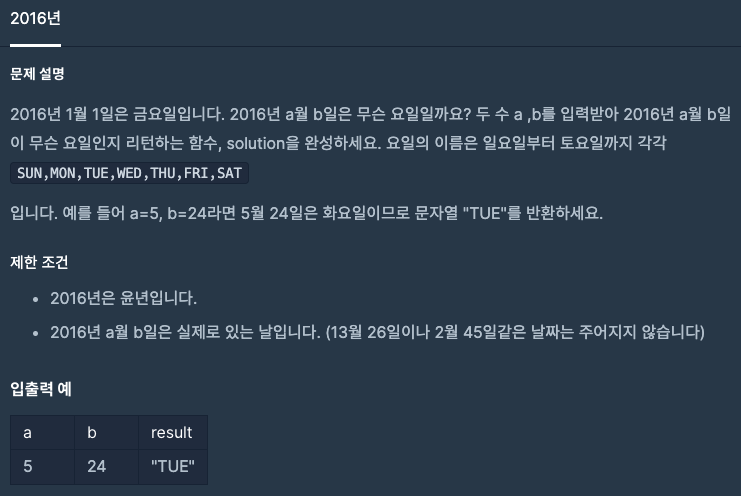
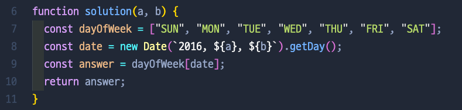

# 2016년

## 📍 문제 & 입출력

## 📍 내가 푼 방법

## 📍 정리

처음에 date 변수를 선언할 때 값을 new Date(2016, a, b).getDay() 이렇게 할당을 했는데, 틀린 답이 출력되었다. 그래서 console.log(new Date(2021, 12, 24).getDay()) 크리스마스이브인 오늘 날짜를 콘솔에 넣어 보았는데도 틀린 값이 출력이 되길래, date 객체를 잘못 씀을 깨달았다. 그 후로 console.log(new Date("2021, 12, 24").getDay()) 이렇게 날짜를 따옴표로 묶어서 string 형식으로 요일을 출력하니까 제대로 금요일이라는 요일이 출력됐다. 그래서 위에에도 new Date(`2016, ${a}, ${b}`).getDay() 배틱을 추가해 값을 할당했더니 정상적으로 출력 되었다. 문제 해결 🤓

---

[ 문제 출처: [Programmers](https://programmers.co.kr/) ]
