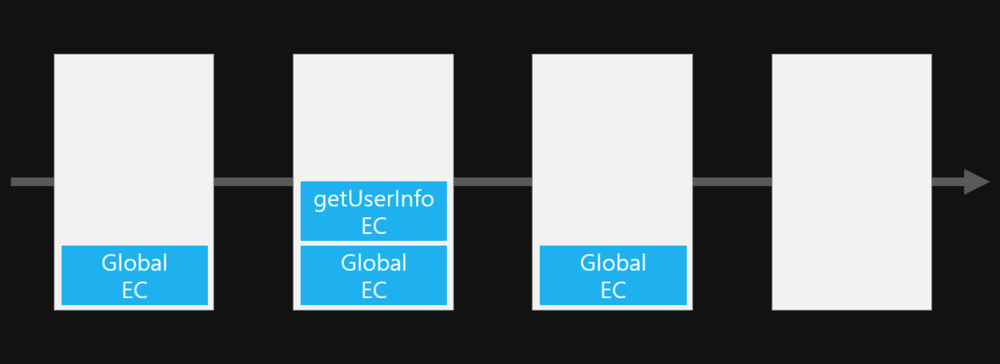

# 5. 실행 컨텍스트

# 🔖 Execution Context (실행 컨텍스트)

```tsx
/* 1 */ const username = "Jaeyoung"; // 1. Jaeyoung이라는 값을 할당
/* 2 */ var age = "28"; // 2. 28이라는 값을 할당

/* 3 */ function getUserInfo(name, age) {
  /* 4 */ age -= 1;
  /* 5 */ console.log(`${name}: ${age}`);
  /* 6 */
} // 3. 함수 실행

/* 7 */ getUserInfo(username, age); // 4. getUserInfo 함수 호출
```

- 실행 컨텍스트는 자바스크립트 코드가 실행되는 환경을 의미한다.
- 자바스크립트의 소스 코드가 실행 될때에는 2step이 있다.
  1. `소스코드 평가` 과정 → 1번째 줄 부터 7번째 줄 까지 쭉 내려가면서 선언문들을 먼저 실행 (1, 2, 3 줄)
  2. `소스코드 실행` 과정 → 그리고 다시 돌아가서 위에서 부터 아래로 비어있는 username, age ... 이런 선언문에게 Jaeyoung, 28 이런 실젝 값을 넣어준다.

### ❓ 그렇다면 3번째 function getUserinfo() 는?

- 1번째 줄의 username 변수, 2번째 줄의 age 변수는 `전역변수`라고 한다. → 함수 밖에서 선언
- 3번째 줄 function 안에 들어있는 age는 `지역변수`라고 한다. → 함수 안에서 선언
- 처음에 소스코드 평가가 끝나고 실행이 될때, 3번째줄에 오면 function getUserInfo 라는 함수가 선언이 되기 시작한다. → 이때 전역에 있던 제어권이 function getUserInfo에 넘어오게 된다. → 이렇게 함수를 만나면 그 안에 있는 것들을 또 소스코드 평가, 소스코드 실행 단계를 거치게 된다.
- 함수안에 함수가 있을 수도 있고, 하나의 문서에 수 많은 함수들이 있을 수 있는데, 그때마다 분명한 규칙은 있지만 제어권이 지역→ 전역 → 지역 ... 이런식으로 변경 되기 때문에 실행 컨텍스트라는 실행 환경이 도움을 준다.



- 사진에서 보이는 것 처럼 처음에 1, 2번째 줄 처럼 전역에 있는 변수들을 위해 [콜 스택](https://www.notion.so/f7ea9f1557b64e4c83ede0936b4a6f93) 이라는 데이터 구조안에 Global 실행 컨텍스트가 생성이 된다.
- 그리고 이제 전역 소스실행 시간때 쭉쭉 내려오다가 3번째줄을 만나면 제어권이 함수에게 가면서 getUserinfo를 위한 실행 컨텍스트가 생성되고 이거는 global 실행 컨테스트위에 스택이된다.
- getUserInfo안에서 소스코드 평가, 소스코드 실행이 다 끝나면 이 실행 컨텍스트는 제거된다.
- 다시 global로 돌아와 끝까지 소스코드를 실행시킨뒤 스택되어있는 이 실행 컨텍스트도 제거된다.

---

참고: [[young_pallete.log](https://velog.io/@young_pallete/JavaScript-%EC%8B%A4%ED%96%89-%EC%BB%A8%ED%85%8D%EC%8A%A4%ED%8A%B8%EB%A5%BC-%ED%8C%8C%ED%97%A4%EC%B3%90-%EB%B3%B4%EC%9E%90)]
