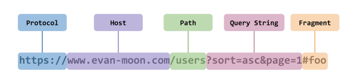
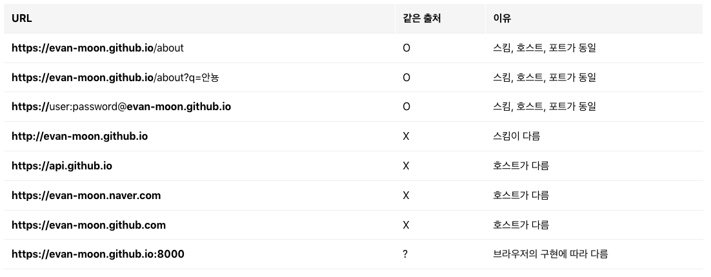

# 4. CORS

---

## 🔖 CORS 란?

- 교차 출처 리소스 공유 (Cross-Origin Resource Sharing, CORS)는 추가 HTTP 헤더를 사용하여, 한 출처에서 실행 중인 웹 애플리케이션이 다른 출처의 선택한 자원에 접근할 수 있는 권한을 부여하도록 브라우저에 알려주는 체제
- 웹 애플리케이션은 리소스가 자신의 출처(도메인, 프로토콜, 포트)와 다를 때 교차 출처 HTTP요청을 실행한다.

## 🔖 출처(Origin)?

- Host뒤에 :80, :443 과 같은 port 번호가 생략 되어있다.

- `출처`는 Protocol + Host + Port 번호까지 모두 합친 것을 의미 = 서버 위치를 찾기위해 필요한 기본적인 것들을 합쳐 놓은 것

## 🔖 같은 출처, 다른 출처 구분

- 두개의 URL 구성 요소 중 `Sheme, Host, Port`이 3가지만 동일하면 같은 출처로 판단된다. (Sheme = https://)

## 🔖 CORS 에러 와 해결 방법

- CORS에러는 서로 다른 출처(Origin) 간에 리소스를 전달하려고 할 때 나오는 에러
- CORS 요청이 가능하려면 서버에서 특정 헤더인 Acess-Control-Allow-Origin과 함께 응답 해야 한다. (와일드 카드를 사용하는게 편하지만, 보안을 위해 출처를 명시해주는게 좋다. ex.`Access-Control-Allow-Origin: https://evan.github.io` )

## 🔖 더 공부해야 할 것

- [ ] Preflight Request

---

[ 참고: [Evans Library](https://evan-moon.github.io/2020/05/21/about-cors/)]
