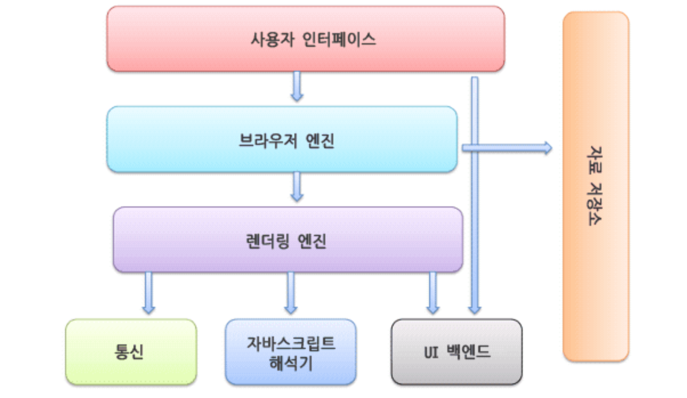

# 5. 브라우저 렌더링 과정

## 🚀  브라우저 렌더링 과정

### 👉🏻  사용자 인터페이스

1. 사용자가 url을 주소창에 입력해서 접속하려고 시도

### 👉🏻  브라우저 ↔ DNS

1. 브라우저 → DNS “www.google.com의 IP주소가 뭐야?”
2. DNS → 브라우저 “1.234.5435.... 이게 그 도메인의 IP주소야”

### 👉🏻  브라우저 ↔ 해당 IP 서버

1. 브라우저 → 서버 “나 이런 데이터가 필요해” `HTTP Request`
2. 서버 → 브라우저 “여기 요청한 데이터 받아” `HTTP Response`

### 👉🏻  브라우저

- “이제 필요한 데이터 있어, 사용자가 이해할수있도록 예쁘게 그려야지”
- “ 그리기 전에 데이터 해석 먼저해야지” `Parsing`

1. 브라우저의 렌더링 엔진 + HTML 파일 파싱 → DOM tree 생성
2. 렌더링 엔진 + 스타일 태그 → CSS파일 파싱 → CSSOM tree 생성 → HTML 파일로 돌아감
3. 렌더링 엔진 + 스크립트 태그 → 자바스크립트 엔진에게 제어권을 줌
4. 자바스크립트 엔진 → 코드를 해석하여 ATM 트리를 만듬/ 실행 → 다시 HTML 파일로 돌아감
5. 브라우저는 → DOM tree+ CSSOM tree = Rendere tree를 만든다 ⇒ 여기 까지가 `Construction`
6. 렌더링 엔진 → 렌더 트리의 요소들을 화면의 올바른 위치에 표시 ⇒ `Layout`
7. UI 백앤드 → 렌더 트리의 요소들을 돌면서 UI를 그린다 ⇒ `Paint`
8. 요소들의 레이어를 순서대로 구성 ⇒ `Composition` ⇒ z-index 낮은 요소 놓고 높은 요소를 놓는 것
9. Layout - Composition ⇒ `Opperation`

---

참고 : [[David’s GitHub](https://davidhwang.netlify.app/Developments/browser-rendering-process/)]
