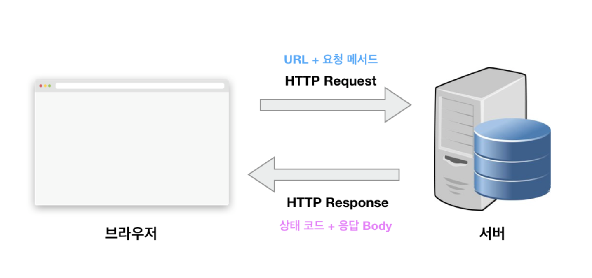

# 6. HTTP/HTTPS

---

# 🔖 HTTP

- HyperText Transfer Protocol
  - Hypertext: 문서와 문서가 링크로 연결되어 있는 형태의 문서. Hypertext의 가장 중요한 문서 양식이 HTML이다.
  - Protocol: 상호 간에 정의한 규칙을 의미하며, 특정 기기 간에 데이터를 주고받기 위해 정의되었음
- HTML을 전송하기 위해서 만들어진 통신 규약이 HTTP이다.
- 웹에서는 브라우저와 서버 간에 데이터를 주고받기 위한 방식으로 HTTP 프로토콜을 사용
- http://www.naver.com 이라고 칠때는 www.naver.com이라는 곳이랑 통신을 할 것인데, http protocol을 이용해서 통신을 할 것이라는 뜻이다.
- 상태가 없는(stateless) 프로토콜입니다. 데이터를 주고 받기 위한 각각의 데이터 요청이 서로 독립적으로 관리가 됨

### ✏️  HTTP 요청 메서드

- URL을 이용하면 서버에 특정 데이터를 요청할 수 있다. 여기서 요청하는 데이터에 특정 동작을 수행하고 싶으면 HTTP 요청 메서드(Http Request Methods)를 이용한다.
  - **GET** : 존재하는 자원에 대한 **요청**
  - **POST** : 새로운 자원을 **생성**
  - **PUT** : 존재하는 자원에 대한 **변경**
  - **DELETE** : 존재하는 자원에 대한 **삭제**

### ✏️  HTTP 상태 코드

- URL과 요청 메서드가 클라이언트에서 설정해야 할 정보라면 HTTP 상태 코드(HTTP Status Code)는 서버에서 설정해주는 응답(Response) 정보이다.
  - `200번`대의 상태 코드는 대부분 성공을 의미
  - `300번`대의 상태 코드는 대부분 클라이언트가 이전 주소로 데이터를 요청하여 서버에서 새 URL로 리다이렉트를 유도하는 경우
  - `400번`대 상태 코드는 대부분 클라이언트의 코드가 잘못된 경우. 유효하지 않은 자원을 요청했거나 요청이나 권한이 잘못된 경우 발생. 가장 익숙한 상태 코드는 404 코드. 요청한 자원이 서버에 없다는 의미
  - `500번`대 상태 코드는 서버 쪽에서 오류가 난 경우

# 🔖 HTTPS

- HTTP 프로토콜의 보안 버전, HTTPS 는 보안 장치가 더 결합되어있는 통신 방식
  - 홈페이지 로그인이나 회원가입, 온라인 결제 등에 적용
- 데이터가 암호화 되지 않는 HTTP의 단점을 극복하고자 HTTP에 SSL이라는 기술을 더한것
  - 클라이언트가 전송하는 데이터, 서버가 다시 주는 데이터가 암호화되기때문에 제3자가 도청을 할 수 없다

# 🔖 SSL

- **SSL**(Secure Sockets Layer)은 암호화 통신과 그 암호화 통신에 사용되는 키를 공유할 수 있도록 하는 기술 (=인증서)
- **인증기관**은 **CA**(**C**ertificate **A**uthority)라고 하는데, 인증기관은 암호화시 사용되는 키를 담은 **인증서**를 발급하고 관리
- SSL에서는 2가지 암호화 기법을 사용한다
  - [7. 암호화 기법 (대칭키, 비대칭키)](https://www.notion.so/7-0d35f788721d409e91e9547f8d740c78)

# 🔖 HTTPS/SSL 상세 과정

### 1. SSL 인증서 생성

1. `서버` 비밀키/공개키 생성 → 서버 공개키를 CA에 전달, SSL 인증서 발급 요청
2. `CA` CA비밀키로 암호화된 인증서 발급 (이 안에는 서버 공개키가 들어있음)

### 2. Handshake(악수): 클라이언트와 서버가 통신을 하기 위해 서로를 파악하는 과정

1. `Client Hello` 클라이언트 → 서버 정보 전달
   - 클라이언트에서 생성한 랜덤 데이터
   - 클라이언트가 지원하는 암호화 방식들
   - 세션 아이디(식별자)
2. `Server Hello` 서버 → 클라이언트 응답
   - 서버에서 생성한 랜덤 데이터
   - 서버가 선택한 암호화 방식 (서로 암호화 방식을 맞추는 작업)
   - **`SSL 인증서`**
3. `클라이언트`
   - 서버에게 받은 인증서 확인 (브라우저에 내장된 CA리스트에 있는 CA의 인증서인지 확인)
   - 브라우저에 내장된 해당 CA의 공개키로 → 인증서 복호화 → **`서버 공개키`** 획득 → 문서 암호화해서 서버에 보냄
4. `서버`
   - 암호화 된 문서 `서버 비밀키`로 복호화 → `session key`(대칭 키 방식) 생성 → 클라이언트와 공유
   - 클라이언트-서버는 데이터를 주고 받을 때, session key를 통해 '대칭키 방식'으로 암호화하여 통신한다.
5. 핸드쉐이크 종료
   - 서버의 신원이 확인 달성
   - 데이터 통신에 사용할 '대칭키 암호화 키값(session key)'도 공유 달성

### 3. 세션(전송): 실제로 서버와 클라이언트가 데이터를 주고 받는 단계

- 클라이언트 - 서버 간 공유된 대칭키 (session key) 사용해서 데이터 주고 받음

### 4. 세션 종료

1. 데이터 전송 종료
2. SSL 통신 종료
3. 'session key' 폐기
   - 매번 연결 시마다 새로운 session key를 생성하여 아주 짧은 시간만 사용하므로, 혹시 탈취되더라도 비교적 안전

---

[ 출처 : [캡틴판교](https://joshua1988.github.io/web-development/http-part1/), [코끼리를 냉장고에 넣는 방법](https://dololak.tistory.com/541), [카레유](https://curryyou.tistory.com/207)]
