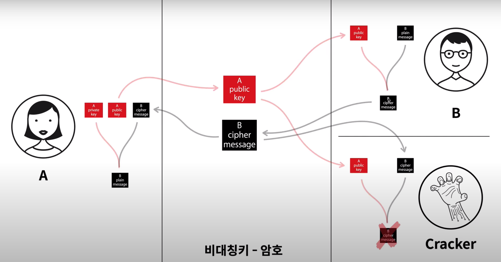

# 7. 암호화 기법 (대칭키, 비대칭키)

---

# 🔖 대칭키 방식

- 암호화할 때, 복호화 할 때 동일한 키를 쓰는 방식
- 내가 가지고 있는 정보를 나만 몰래 가지고 있으려면 쓰면 된다.

# 🔖 비대칭키 방식

- 암호화할 때, 복호화 할 때 다른 키를 쓰는 방식 (공개키, 비공개키를 사용)
- 내가 가지고 있는 정보를 어떤 특정한 사람에게 보여주고 싶다 → 그래서 그 사람한테 암호를 풀 수 있는 키를 줘야 함 → 근데 해커가 키를 도난 할 수 있기 때문에 대칭 키가 아닌 비대칭 키 방식을 사용

> ❗ **비대칭키 사용하는 방식**
>
> - A라는 사람: 비밀문서를 받을 사람
> - B라는 사람: 비밀문서를 보낼 사람
> - Cracker: 해커 (나쁜 사람!)

1. A → 공개키, 비공개키 두 가지 키를 가지고 있음
2. A → 인터넷이나 어딘가에 공개키를 공유한다.
3. B → 공개된 A의 공개키를 다운로드해온다. (이때, 이 공개키는 B뿐만이 아닌 아무나 다 다운로드할 수 있기 때문에 해커도 A의 공개키를 다운로드함)
4. B → 자신이 쓴 평문 (암호화할 문서)을 이전에 다운로드했던 A의 공개키로 암호화 시킴 → 암호화된 문서 생성
5. B → 암호화된 문서 다시 인터넷에 공개함
6. A → B가 암호화 한 문서를 다운로드함 (이때, 해커나 아무나 다 암호화된 문서를 다운로드할 수 있음)
7. A → B가 문서를 암호화할 때 A의 공개키를 사용해서 암호화를 했기 때문에 A는 자신의 비밀키를 사용해서 암호화된 문서를 복호화 할 수 있다.
8. 해커 → 해커도 B가 암호화된 문서, A의 공개키를 다 다운로드했지만 A와는 달리 비공개키가 없기 때문에 암호화된 문서를 복호화 할 수가 없다.
9. B → A의 비공개키가 없기 때문에 아무리 자기가 쓴 문서여도 복호화 할 수 없다.
10. 즉, 비공개키는 절대! 절대! 절대! 공개되면 안 된다!

- 클라이언트 - 서버 사이에서 데이터를 주고 받을때 SSL이라는 인증서를 통해 암호화를 시켜서 데이터를 주고 받는다.
- SSL 이라는 통신 방법 위에서 동작하는 서비스중하나가 HTTP 이고, SSL를 이용하면 HTTPS가 되는것이다

---

[ 출처 : [생활코딩](https://www.youtube.com/watch?v=MR4sCU82tgo) ]
