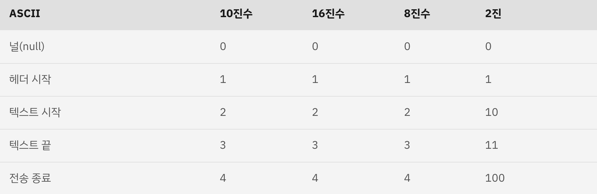
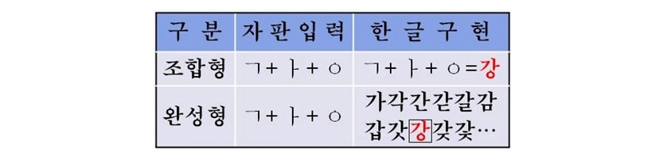

# 유니코드, UTF-8, 아스키코드?

### ✏️  아스키코드 (ASCII코드)

- 컴퓨터는 2진수만 이해하는 기계이기 때문에 인간이 입력하는 언어를 이해하지 못한다. 영문 키보드로 입력할 수 있는 모든 문자들과 기호들에 코드값을 부여한 것이 아스키코드.
  

### ✏️  **유니코드(Unicode)**

- 국제 표준 문자표
- 아스키코드와 달리 세계 모든 언어와 기호에 컴퓨터가 알아들을 수 있는 코드값을 부여한 것이 유니코드다.

### ✏️  **UTF-8**

- Unicode Transformation Format, 8비트로 인코딩
- 유니코드를 인코딩하는 방식 중 하나

### ✏️  **UTF-16**

- Unicode Transformation Format, 16비트로 인코딩
- 유니코드를 인코딩하는 방식 중 하나
- 조합형 방식의 문자집합

### ✏️  **EUC-KR**

- 완성형 인코딩 방식

### ❓더 공부해야 할 것

- [ ] REST API 와 인코딩 관계
- [ ] 인코딩은 몇 바이트를 읽을 것인지에 대한 약속이기 때문에 인코딩이 서로 다르면 문자가 깨져서 표시된다.

---

이미지 출처: [ [차근차근](https://dowhathewanna.tistory.com/2), [IBM](https://www.ibm.com/docs/ko/aix/7.1?topic=adapters-ascii-decimal-hexadecimal-octal-binary-conversion-table) ]
