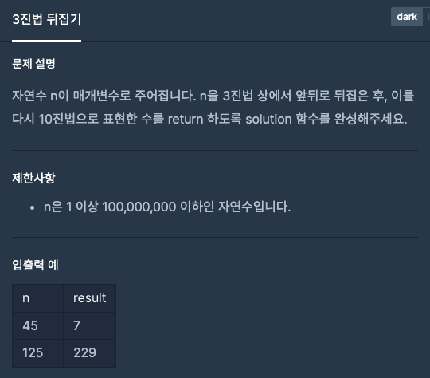
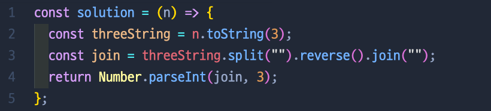

# 3진법 뒤집기

## 📍 문제 & 입출력



## 📍 내가 푼 방법



## 📍 정리

- 2번째 줄에서 10진법인 수를 3진법으로 바꾸는 건 할 줄 알았지만 문제는 4번째줄 처럼 `Number.parseInt(join, 3)` 이렇게 다시 3진법으로 바꾸는 법을 몰라서 구글링을 해서 해결 할 수 있었다.

  ### 10진법 -> 2, 8, 16 진법으로 변환

  ```tsx
  let value = 10;

  value.toString(2); // 1010
  value.toString(8); // 12
  value.toString(16); // a
  ```

  ### 2, 8, 16 진법 -> 10진법으로 변환

  ```tsx
  let bin = 1010,
    oct = 12,
    hex = "a";

  Number.parseInt(bin, 2); // 10
  Number.parseInt(oct, 8); // 10
  Number.parseInt(hex, 16); // 10
  ```

---

[ 문제 출처: [Programmers](https://programmers.co.kr/) ]
