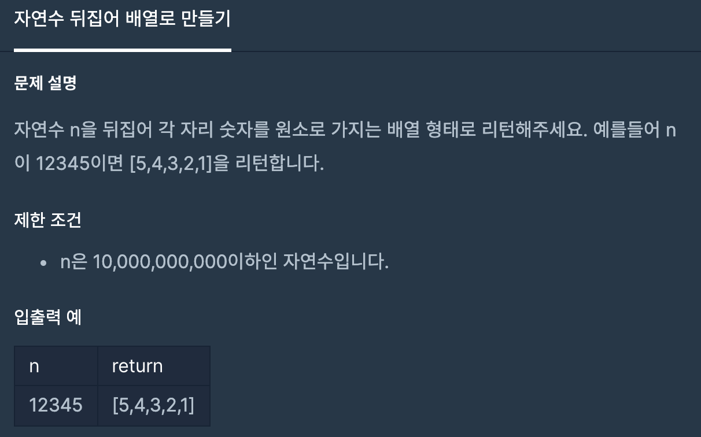
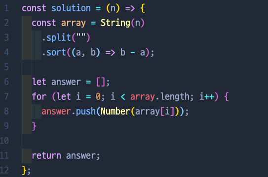
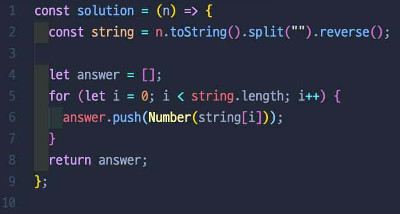
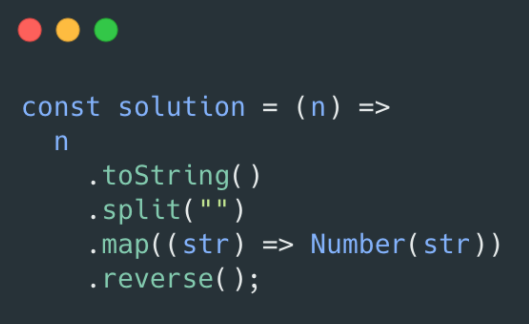
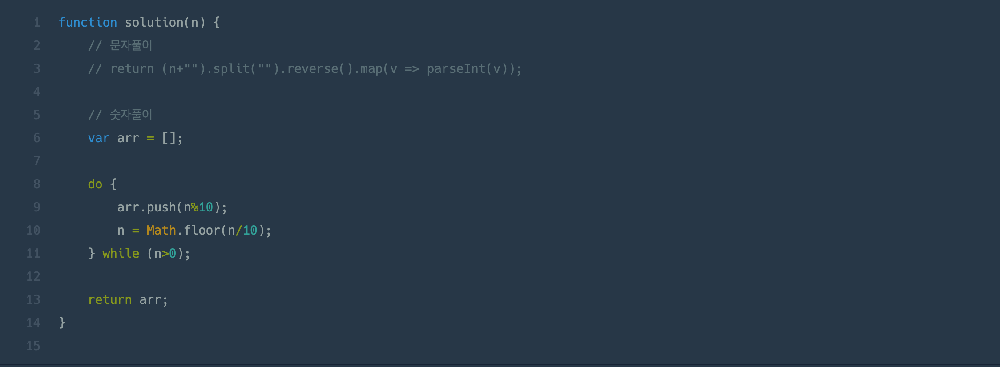

# 자연수 뒤집어 배열로 만들기

## 📍 문제 & 입출력

## 📍 한달 전 내가 푼 방법

## 📍 한달 후 내가 푼 방법

## 📍 다른 사람들이 푼 방법

## 📍 정리

- 한달 전에 이 문제를 풀었을때... 테스트를 통과 하지 못했다. 근데 도대체 어디서 잘못된건지 모르겠던 문제.... 오늘 다시 풀면서 알게 됐는데 문제 지문에는 `“자연수 n을 뒤집어”`라고 나와있다. 그냥 일반 .reverse()를 하면 되는데 `.sort((a, b) => b - a )`로 내림차순 정리를 해버리니깐 계속 통과하지 못했다. `.sort()`대신에 `.reverse()`를 씀으로써 테스트 통과!

---

[ 문제 출처: [Programmers](https://programmers.co.kr/) ]
