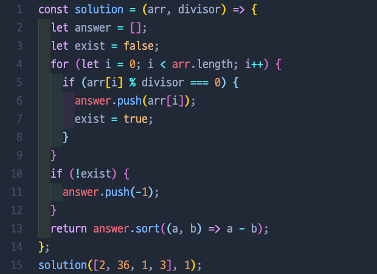
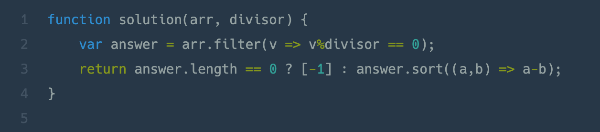

# 나누어 떨어지는 숫자 배열

## 📍 문제 & 입출력

>

## 📍 내가 푼 방법

## 📍 다른 사람들이 푼 방법

## 📍 정리

- 나는 만약 아무것도 divisor로 나누었을때 0으로 떨어지지 않으면 exist를 false로 받아오게 했는데, 다른 사람의 풀이를 봤을때 length로 처리했다. 코드가 훨씬 깔끔한듯 !

---

[ 문제 출처: [Programmers](https://programmers.co.kr/) ]
