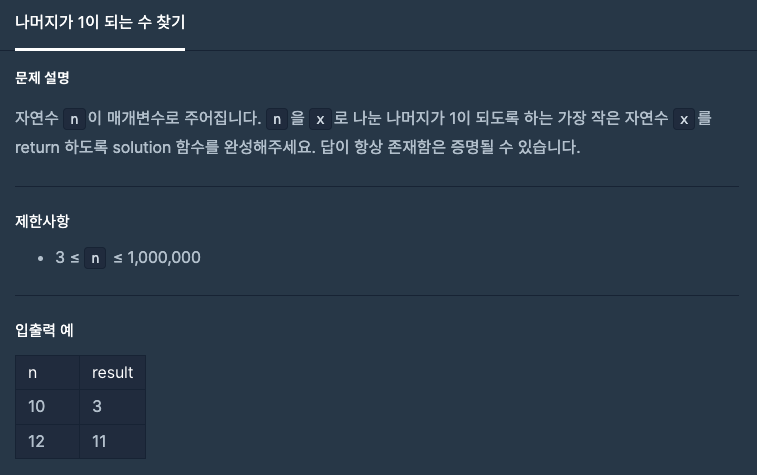
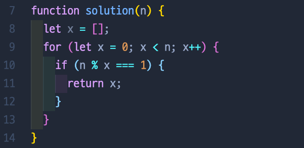
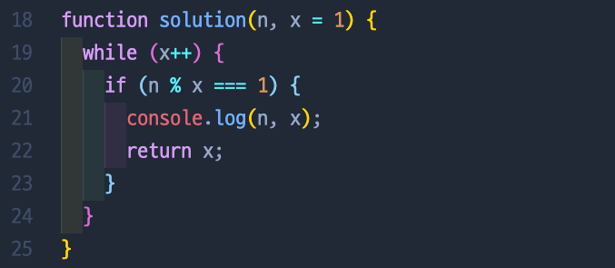

# 나머지가 1이 되는 수 찾기

## 📍 문제 & 입출력

## 📍 내가 푼 방법

## 📍 다른 사람들이 푼 방법

## 📍 정리

내가 풀었을 때 let x =[] 는 왜 해줬는지 기억이 안나지만 ㅎㅎ for문을 사용해서 문제를 풀었다. 다른 사람들의 풀이를 봤을때 while문을 썼던 풀이가 제일 깔끔했다 👍🏻

---

[ 문제 출처: [Programmers](https://programmers.co.kr/) ]
