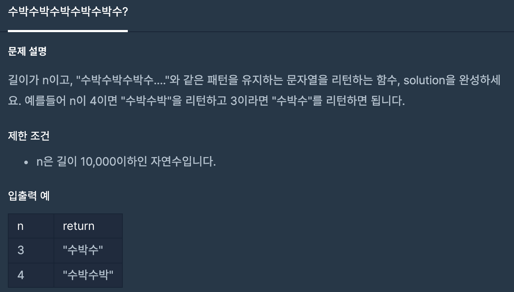
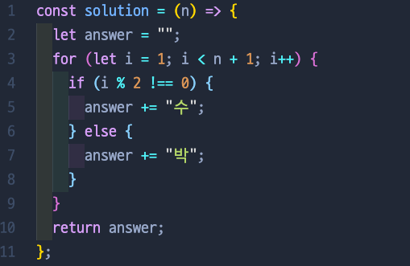

# 수박수박수박수박수박수?

## 📍 문제 & 입출력

## 📍 내가 푼 방법

## 📍 정리

### 👉🏻 Problem

- 3번째 줄에서 처음에는 `for (let i = 0; i < n; i++)` 형식으로 for문 작성했는데, 그러면 i가 0, 1, 2식으로 찍히기때문에 i번 자리 수가 짝수인지 홀수인지 구분하려면 if 문안에 4번째 줄에 if (i+1 % 2 ≠ 0) 이런식으로 해주어야함

### 👉🏻 Solution

- 위에 방법처럼 해주어도 되지만 애초에 3번째줄에 `for (let i = 1; i < n+1; i++)` 식으로 i자체를 짝수/홀수 구분할 수 있도록 i가 1부터 시작해서 n+1보다 작도록 구현함

---

[ 문제 출처: [Programmers](https://programmers.co.kr/) ]
