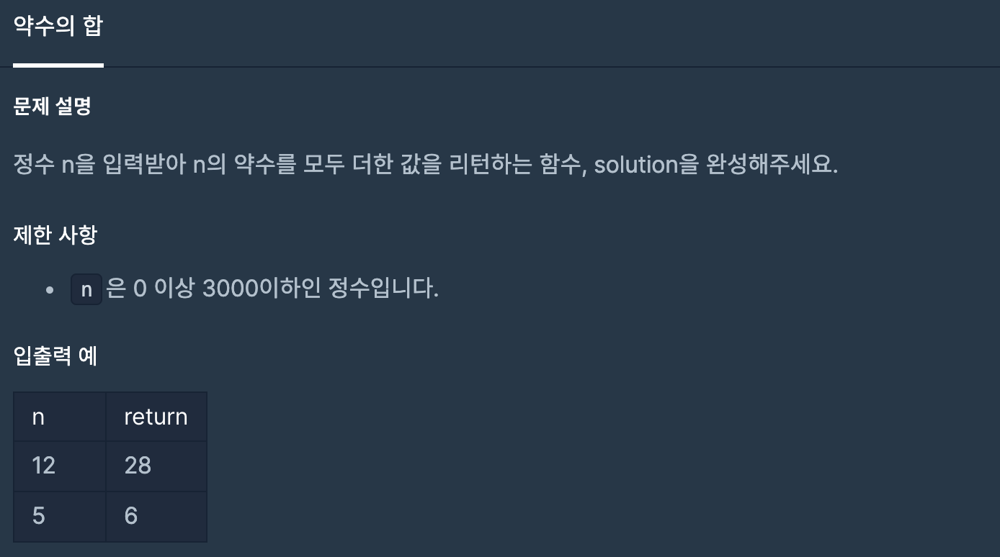
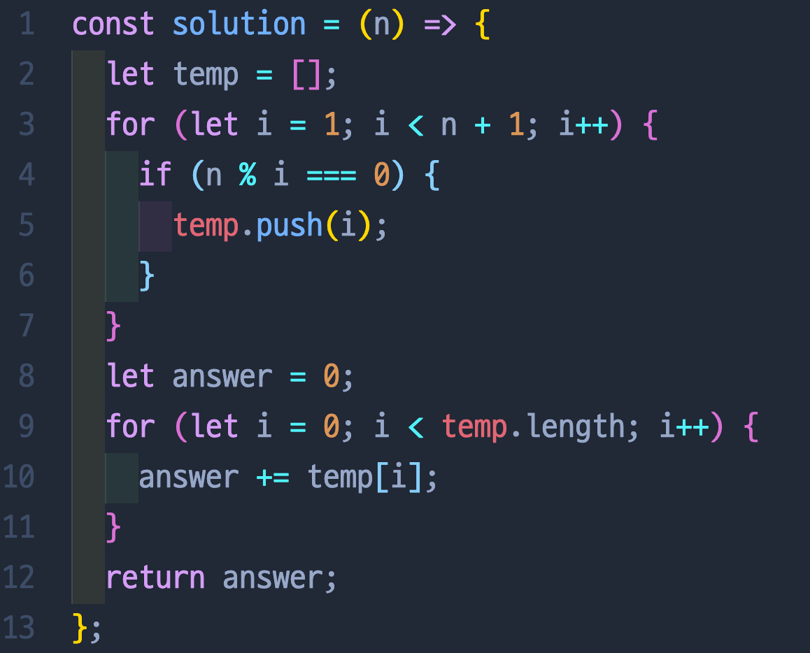
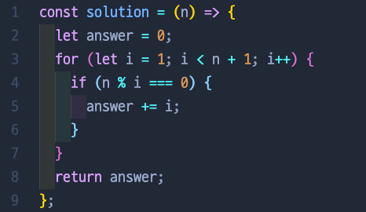

# 약수의 합

Done: No
Level: 1

## 📍 문제 & 입출력

## 📍 한달 전 내가 푼 방법

## 📍 한달 후 내가 푼 방법

## 📍 정리

- (한달 전) for문을 2개를 돌렸다. 첫번째는 약수를 고르기 위해서, 두번째는 약수들을 더하기위해서. for문을 두번 돌리면 시간이 그만큼 걸리기때문에 그렇게 좋은 코드는 아닌거같다. 하지만 한방에 성공!
- (한달 후) 한달 전에 풀었던 풀이를 보면서 의아했다 ㅎㅎ 왜 저렇게 두번 고생을 했지? 아마도 for문을 돌린 후 answer+= 이런식으로 값을 넣어주는게 익숙하지 않아서 저렇게 풀이를 했던 것 같다. 한달 뒤에 다시 푸니깐, 확실히 알고리즘 푸는 실력이 늘었다!

---

[ 문제 출처: [Programmers](https://programmers.co.kr/) ]
