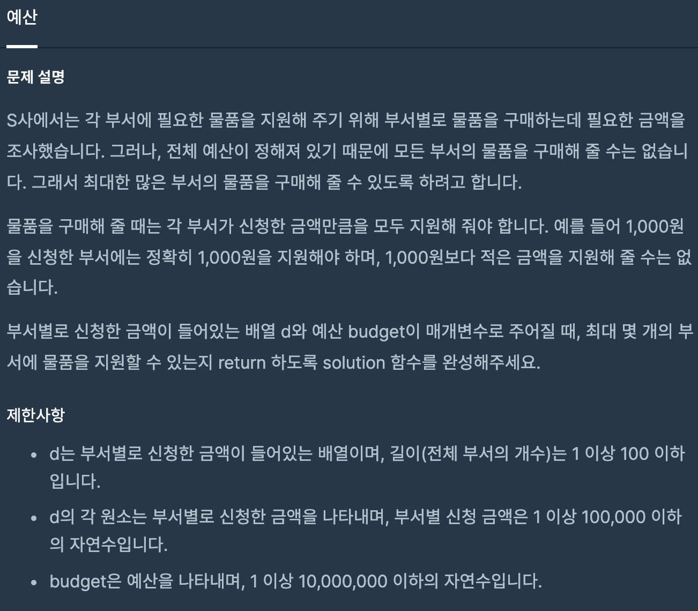
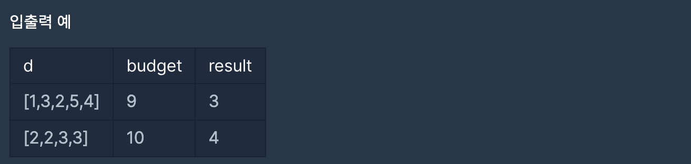
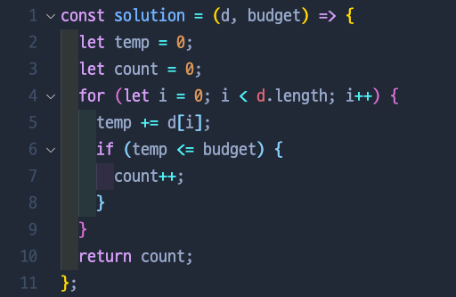
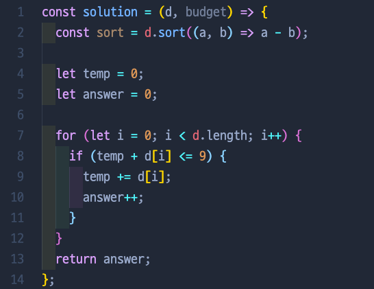

# 예산

## 📍 문제 & 입출력

## 📍한달 전 내가 푼 방법

## 📍한달 후 내가 푼 방법

## 📍 정리

### 👉🏻 Problem (한달 전에 적어 둔 메모)

> 처음에는 위에 sort를 해줘서 작은 수부터 최대한 많은 예산을 잡을 수 있게 했지만, 결국에는 그 식을 쓰지 않고 테스트에 통과됐다. 근데 아마도 sort를 해주고 테스트를 돌려야지 통과돼야 할 거 같은데...? 왜 통과됐지? 다시 한번 풀어봐야겠다.

### 👉🏻 Try

- 한달전에 sort를 사용하지 않고 테스트가 통과 된 것은 운이었다. `.sort()`를 쓰든 안 쓰든 `solution([1,3,2,5,4], 9)` 하면 예상대로 `result = 3`이 나온다. 하지만 만약 `solution([8,1,3,2,5,4], 9)`을 한다면 `result = 2` 가 나온다. 두번째 식을 만들어 봄으로써 sort메소드를 사용 하지 않는다면 오류가 난다는것을 알게되었다.
- 또한 2번째 줄에서 선언 해준 `const sort = d.sort((a, b) => a - b)` 의 변수 sort를 아무곳에서 사용해 주지 않아서 “응? 왜 sort를 사용 안 했지” 했지만 2번째줄 밑에 `console.log(d)`를 했을때 이미 sort된 값이 들어 있는 거를 확인 한 후. sort 메소드는 d의 원래 배열을 변화시키는 메소드임을 깨달았다.

### 👉🏻 Solution

- 이 문제는 sort 메소드를 꼭 써야한다.
- sort 메소드는 원래 origin을 수정한다.

---

[ 문제 출처: [Programmers](https://programmers.co.kr/) ]
