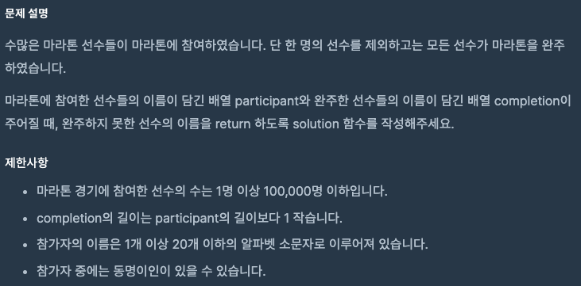
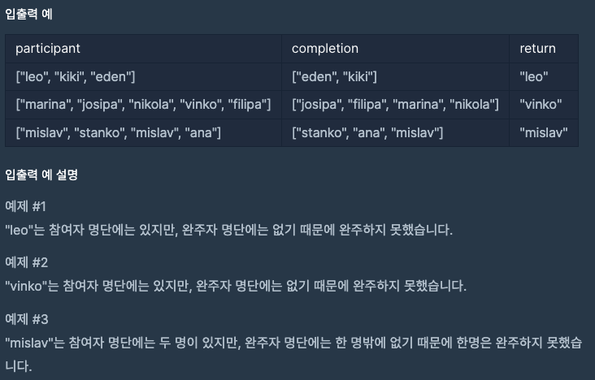
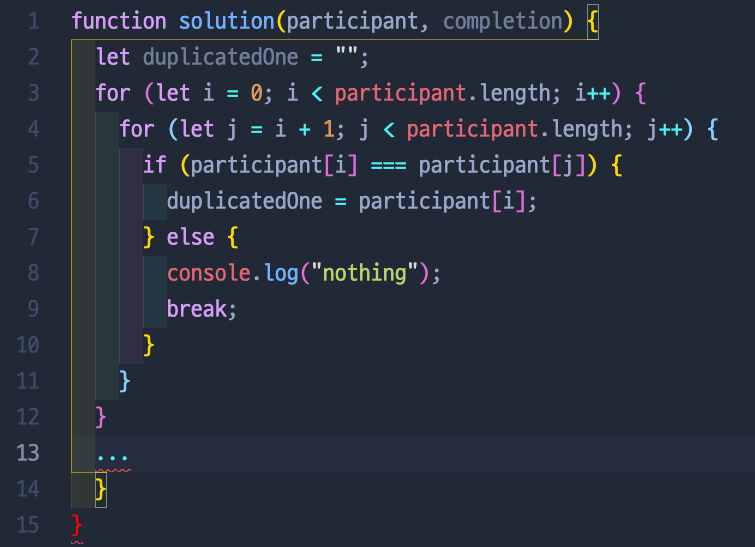

# 완주하지 못한 선수

## 📍 문제

## 📍 입출력

💡 `내가 푼 방법`

우선은 참가자들 중에서 중복되는 이름들을 찾기 위해서 두 개의 for 문을 돌리려고 했다. 하지만 for 문을 두개로 돌리면 시간 초과가 될 거 같았다.

💡 `다른 사람들이 푼 방법`

.sort() method를 사용한다면 정말 간단하게 처리되는 문제였지만 여기까지 생각을 하지 못했다. 참가자 리스트와 완주자 리스트를 정렬한 후 그 둘 배열을 하나씩 비교하면 중복되는 사람을 굳이 찾을 필요 없이 바로 완주하지 못한 선수의 값을 찾아낼 수 있다! 이렇게 또 한 method를 배웠다!

[ 문제 출처: [Programmers](https://programmers.co.kr/) ]
