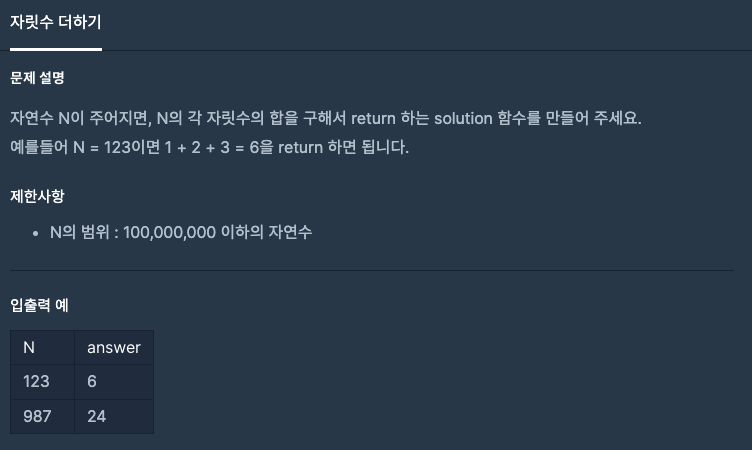
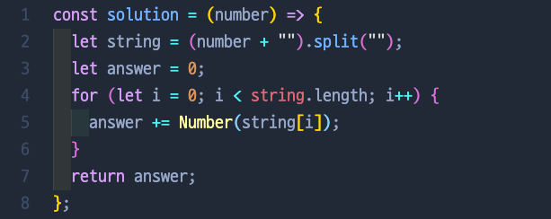

# 자릿수 더하기

## 📍 문제 & 입출력

## 📍 내가 푼 방법

## 📍 정리

- 다른 사람들은 Number () 대신에 parseInt()라는 메소드를 썼다. 검색을 해보니깐 Number()은 소수점까지 반환하고 parseInt()는 정수까지만 반환하는 차이가 있었다.

---

[ 문제 출처: [Programmers](https://programmers.co.kr/) ]
