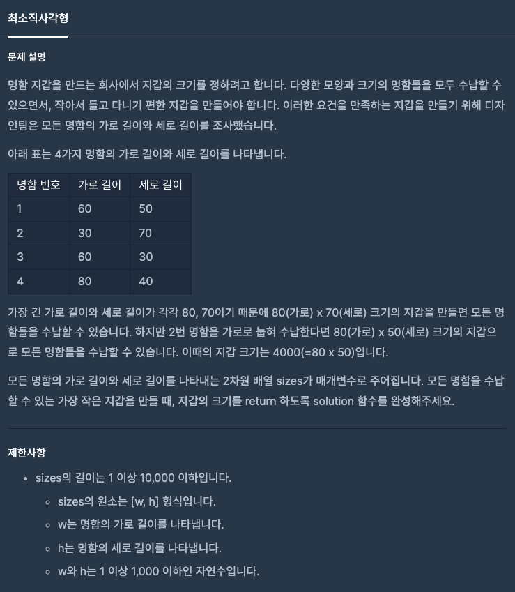
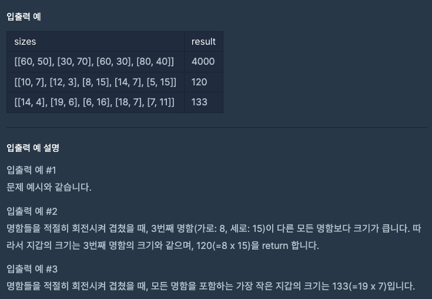
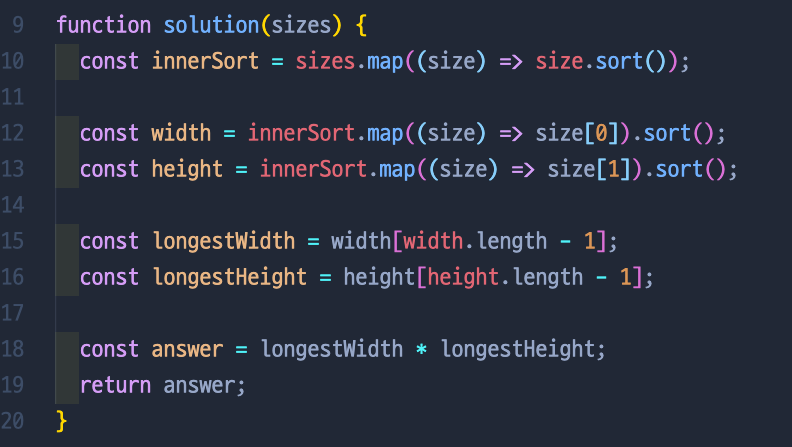
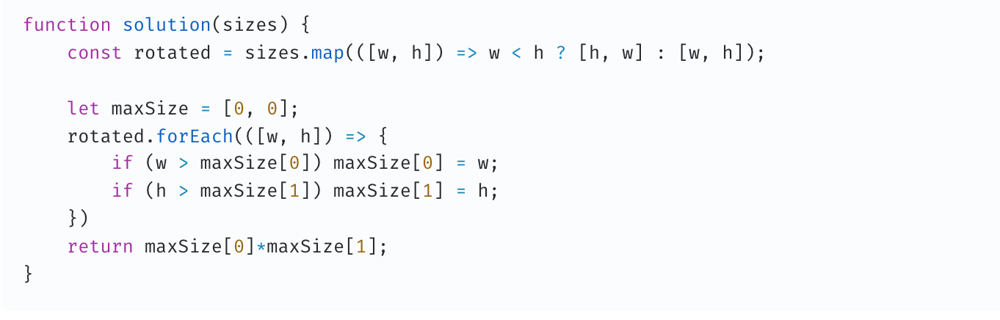

# 최소직사각형

## 📍 문제 & 입출력

## 📍 내가 푼 방법

## 📍 다른 사람들이 푼 방법

## 📍 정리

내 방식대로 하면, map을 세번이나 돌리기때문에 비효율적인 구상이었다. 삼항연산자, forEach를 이용해서 간단하게 풀수있다

---

[ 문제 출처: [Programmers](https://programmers.co.kr/) ]
