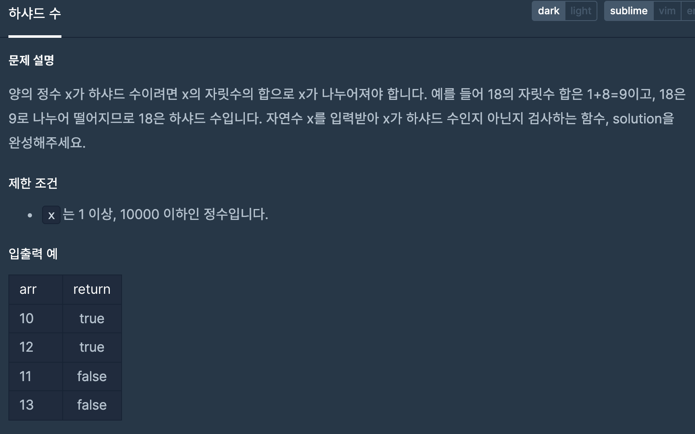
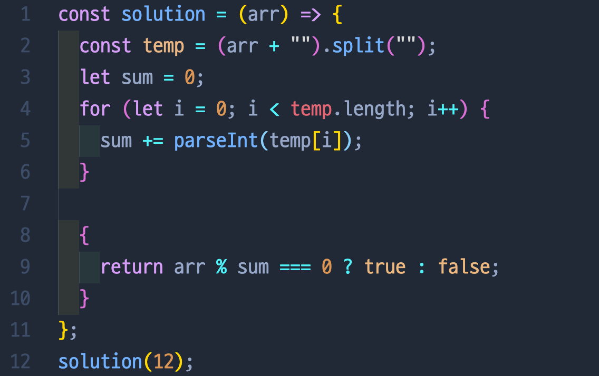
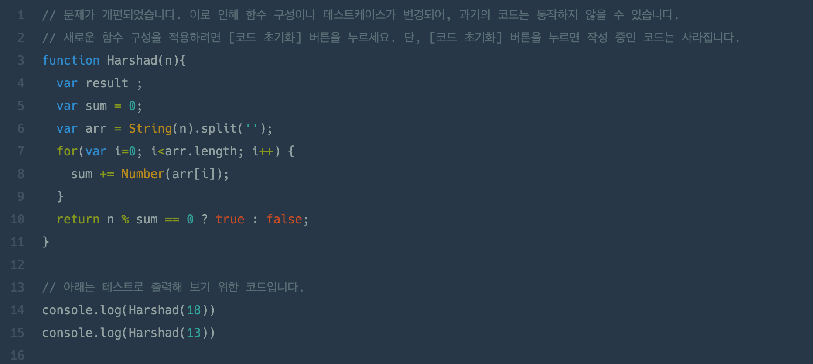

# 하샤드 수

## 📍 문제 & 입출력

## 📍 내가 푼 방법

## 📍 다른 사람들이 푼 방법

## 📍 정리

- 받은 arr 배열을 10단위로 나누어서 몫 과 나머지로 수를 더할까 생각했더니, 100자리 수는 또 100으로 나누고 이런것들이 더 복잡해졌다. 그래서 이전에 풀었던 문제에서 배운 + “”, .split(””)방식으로 수를 분리시키고 둘을 더했다. 알고리즘 문제는 풀면 풀수록 실력이 올라간다!
- 다른사람의 풀이를 봤을때, 내가 (arr + “”) 를 하는 대시넹 Stirng(n)을 쓴거를 찾았다. 앞으로는 이렇게 써봐야겠다.

---

[ 문제 출처: [Programmers](https://programmers.co.kr/) ]
