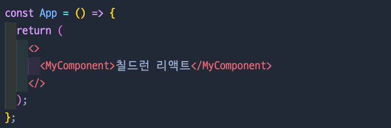
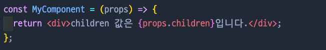
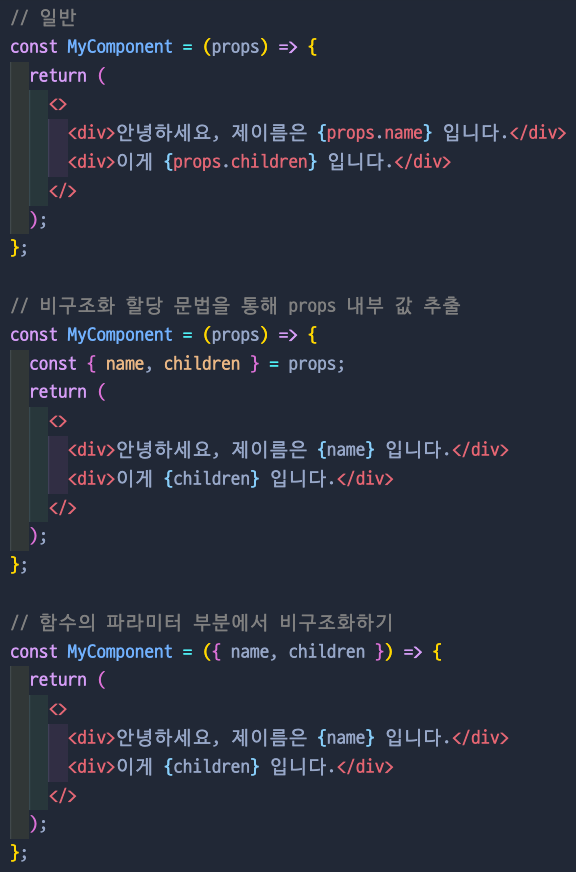
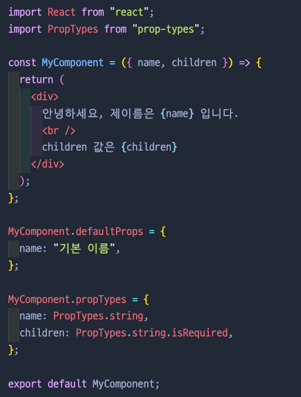
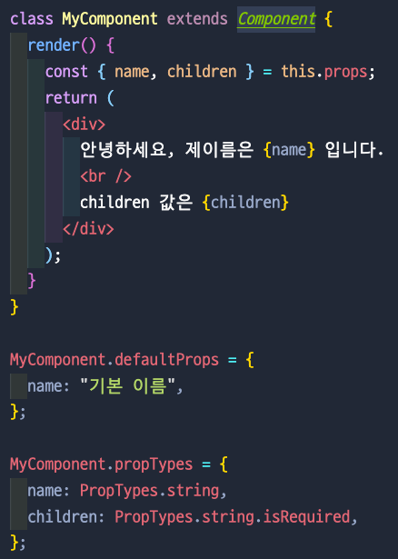
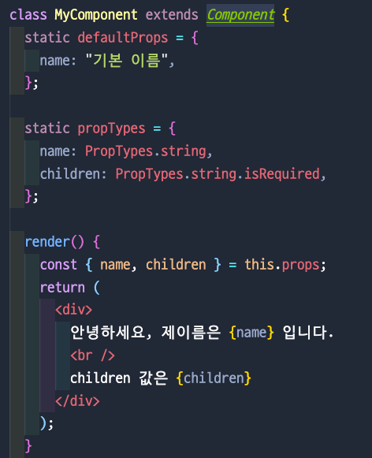
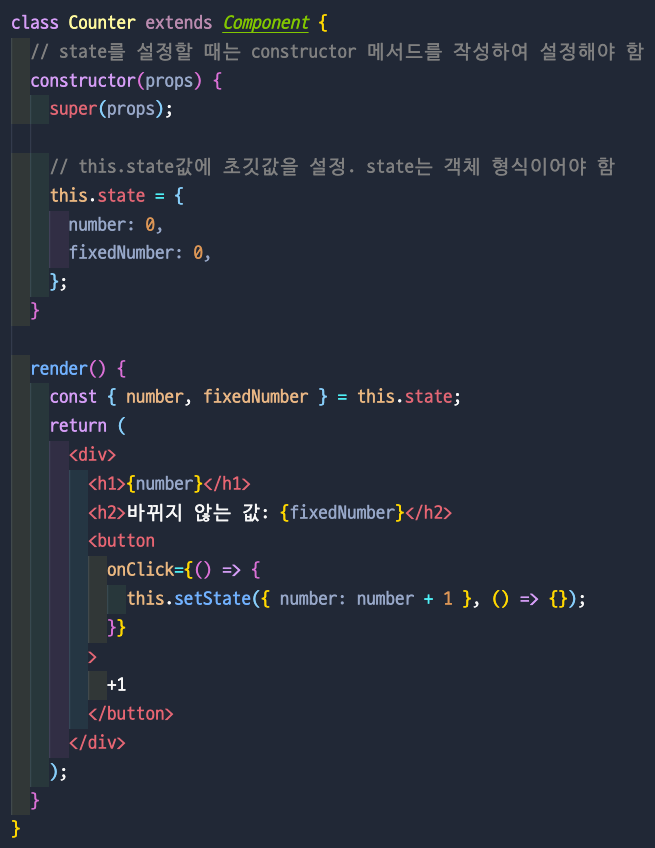
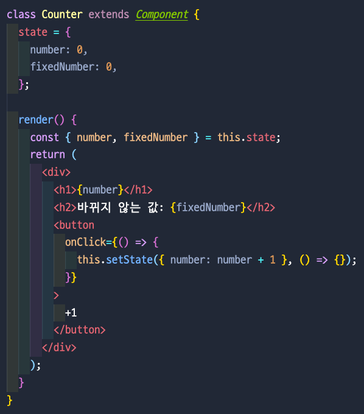
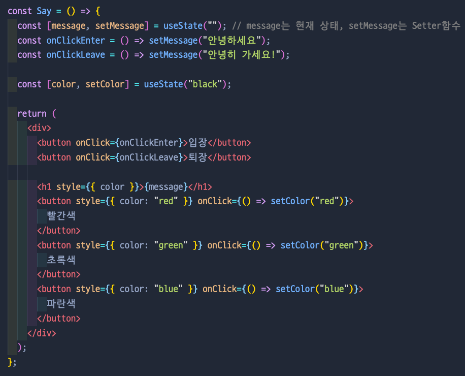

# 4. Props & State

---

## 🔖 Props & State

- 둘 다 데이터를 다루는 방법

| props                                           | state                                  |
| ----------------------------------------------- | -------------------------------------- |
| 부모 컴포넌트가 → 자식 컴포넌트에게 주는 데이터 | 컴포넌트 자기 자신이 가지고 있는 값    |
| 읽기 전용, 수정 불가함                          | 변화 필요할 경우, useState 훅 사용가능 |

- 리액트의 모든 상태값들은 불변성이 유지되어야한다. → setState는 리액트의 불변성을 유지시키기 위해 사용 → Virtual DOM 이 DOM과 차이를 알아내기위해서는 불변성이 유지되어야지 비교가 되기때문이다.

## 🔖 Props

- props는 properties를 줄인 표현으로 컴포넌트 속성을 설정할 때 사용하는 요소
- props 값은 부모 컴포넌트에서 설정

## 🔖 태그 사이의 내용을 보여 주는 children

- 부모 컴포넌트인 App.js 에서 태그 사이에 값을 넣어주면...
  

- 자식 컴포넌트인 MyComponent.js에서 props.children으로 받을 수 있다.
  

## 🔖 비구조화 할당 문법을 통한 props 내부 값 추출

- 비구조화 할당 문법을 통하면 props를 좀 더 간결하게 사용할 수 있다.
  

## 🔖 defaultProps & propTypes & isRequired

- defaultProps: 부모 컴포넌트에서 따로 값을 지정하지 않았을 때 보여 줄 기본값을 설정
- propTypes: props의 타입을 지정할 때 사용
- isRequired: propTypes를 지정하지 않았을 때 경고 메세지를 띄워 줌

👉🏻  defaultProps와 propTypes는 꼭 사용해야 하는건 아니지만, 해당 컴포넌트에 어떤 props가 필요한지 쉽게 알 수 있어 개발 능률이 좋아진다.

## 🔖 Class형 컴포넌트에서 defaultProps, propTypes 사용

### 👉🏻 class형 예제

### 👉🏻 class 내부에서 지정

## 🔖 State

- 컴포넌트 내부에서 바뀔 수 있는 값을 의미
- 컴포넌트 자신은 해당 props를 읽기 전용으로만 사용할 수 있음

### 👉🏻 constructor & 객체 형식의 state

### 👉🏻 state를 constructor에서 꺼내기

## 🔖 useState

- 클래스형 컴포넌트에서의 state초기값은 객체 형태를 넣어 주어야 한다고 배웠는데, useState에서는 반드시 객체가 아니어도 상관이없다.
  

---

[참조: 리액트를 다루는 기술]
