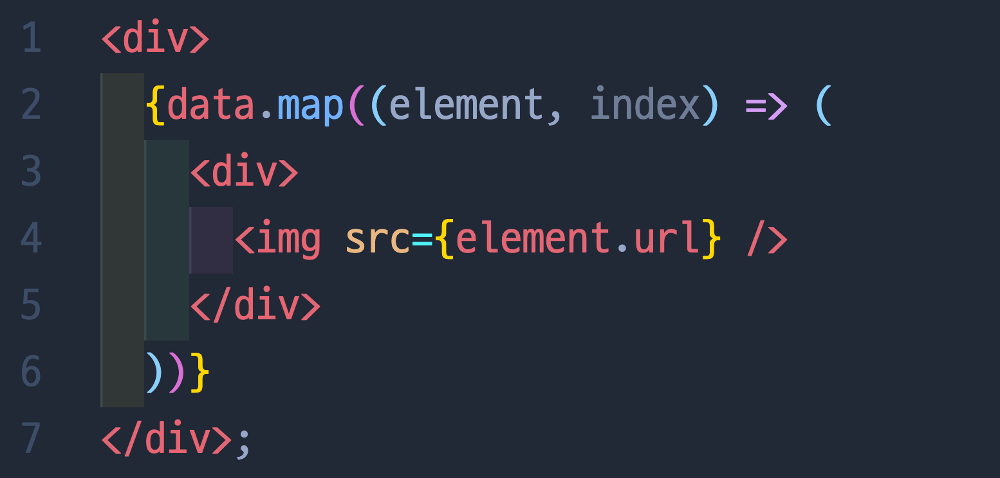
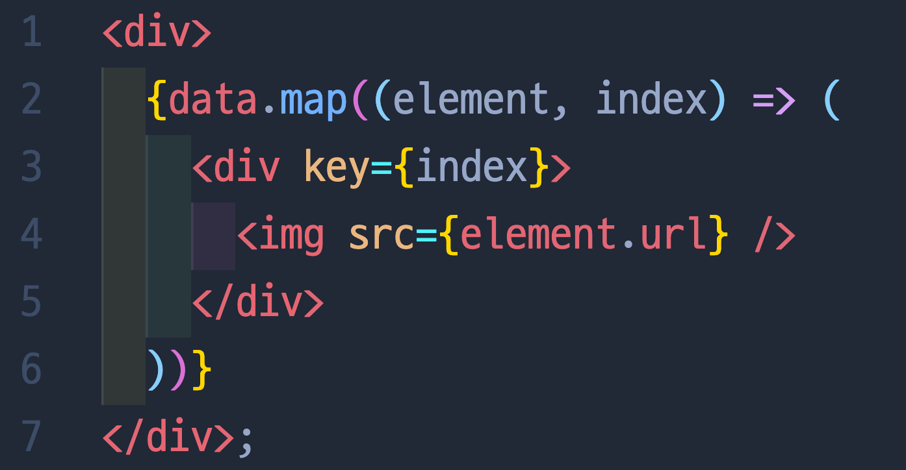

# 7. React 배열의 key 값

---

## 🔖 Error!

- React에서 프로젝트를 할때 위에 사진의 2번째 줄 처럼 배열에 map 메소드를 쓸 일이 많다.
- 하지만 이 코드는 `Warning: Each child in a list should have a unique “key” prop.` 이라는 경고가 뜨게 될것이다.
- 이 말은 map을 돌릴때에는 배열안의 각 요소들이 react가 자신을 식별할 수 있는 고유값이 있어야한다는 뜻이다.

- 이런식으로 2번째줄에 index를 key값으로 써주어도되긴하지만 권장되지 않기때문에 데이터 안에 있는 고유값을 써주는것이 최고!

## 🔖 key값의 용도?

- map을 어떻게 사용하는지, key값을 어떻게 넣는지에 대한 글이 아니기에 오늘의 목적에 집중해보려한다! 왜 key값이 필요한거지?
- 리액트는 필요한 부분만 렌더링한다. 그래서 렌더링을 하려면 이전에 비교해서 현재 추가/수정/삭제 된 부분이 어디인지 정확하게 알아야하는데 그때 이 key 값이 사용이된다.
- 쉽게 설명해서 1, 2, 3 이라는 카드가 나란히 있는데, 제일 뒷 자리에 4번이라는 카드를 추가한다면 리액트는 4번이 추가됨을 알고 이 부분만 효율적으로 렌더링 한다.
- 하지만 위에 방법은 key값을 주지않고 자리를 외우게 하는 방식인데, 만약 이번에는 5번이라는 카드가 제일 앞으로 들어간다면 모든 카드의 자리가 하나씩 밀린다. 그러면 리액트는 key 값이 없이는 모든 카드들이 바뀐걸로 인지해 전부 리렌더링을 하는 비효율적인 일이 생긴다.
- 이거를 방지하기위해서 각 카드에 고유값을 주고, 1번 카드가 뒤로 밀리든 앞에있든 얘는 새로운 애가 아니라는 걸 원래의 key값으로 알려주는것이다.

---

[참고 : [Quokka.log](https://velog.io/@alswl5181/ReactMap-%EC%82%AC%EC%9A%A9%EC%8B%9C-Unique-Key-Prop-%EC%98%A4%EB%A5%98)]
