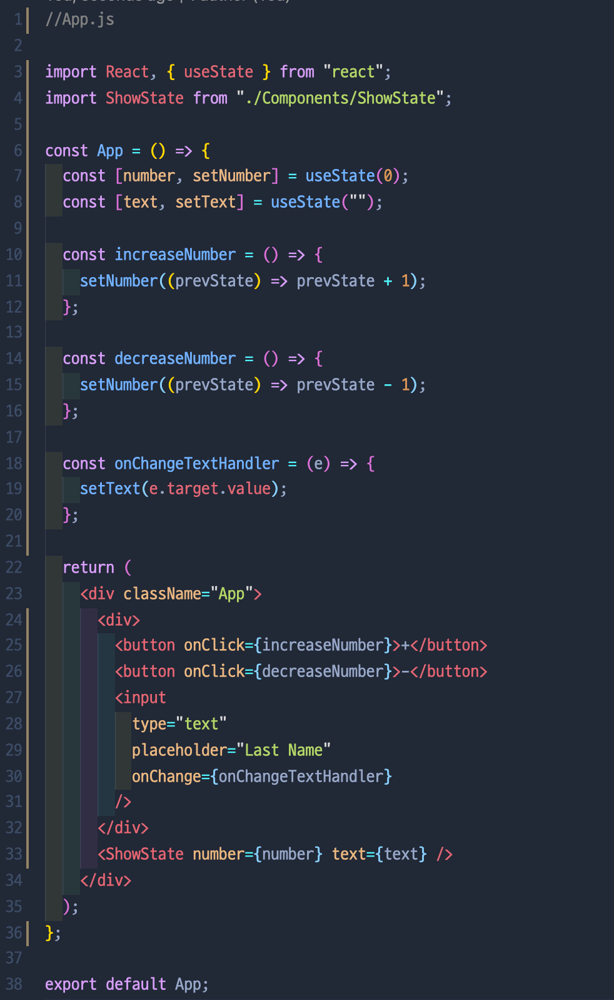
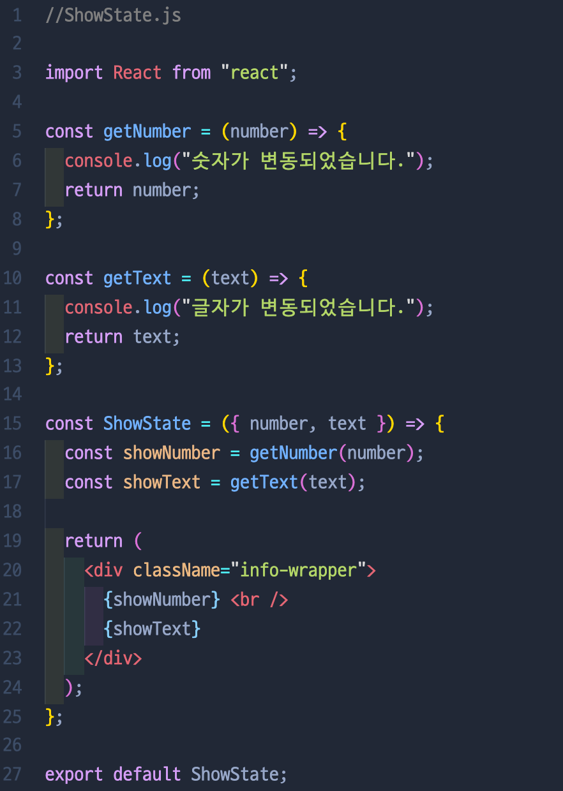
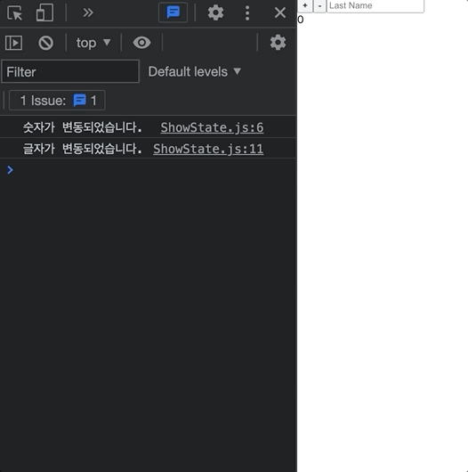
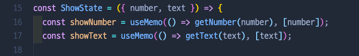
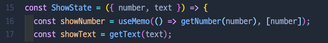

# 8. useMemo

- Returns a [memoized](https://en.wikipedia.org/wiki/Memoization) value.
- Pass a “create” function and an array of dependencies. `useMemo` will only recompute the memoized value when one of the dependencies has changed. This optimization helps to avoid expensive calculations on every render.

```jsx
const memoizedValue = useMemo(() => computeExpensiveValue(a, b), [a, b]);
```

## 🛳 useMemo 사용 전

- `+버튼` or `-버튼`을 누르면 숫자가 변동되면서 `“숫자가 변동되었습니다"` 콘솔이 찍힘으로써 ShowState.js 5번째 줄의 getNumber 함수가 실행됨을 알 수 있다.
- `input 창`에 글을 입력할 때마다 `“글자가 변동되었습니다”` 콘솔이 찍힘으로써 ShowState.js 10번째 줄의 getText 함수가 실행됨을 알 수 있다.
- 여기서 문제는 버튼을 누를 때에도 `getText 함수`가 실행이 되고, input 창에 글을 쓸 때에도 `getNumber 함수`가 실행됨으로써 비생산적인 렌더링이 발생.
- 그래서 `useMemo`를 씀으로써 이 문제를 해결할 수 있다.
  
  
  
  - 숫자를 바꾸든 글자를 바꾸든 숫자, 글자 변경 함수 둘 다 호출되는 상황

## 🛳 useMemo 사용 후

- 16번째, 17번째 줄의 `getNumber, getText 함수`를 `useMemo`로 감싸준다. (number이 바뀔 때에만 getNumber 함수가 호출이 된다!)
- 그러면 밑에 gif에서 보이는 것처럼, 숫자를 변경하면 숫자 함수만 호출. 글자를 변경하면 글자 함수만 호출이 된다.




## 🛳 좀 더 확실히 비교하기위해...

- getNumber 함수에만 useMemo 훅을 적용을 하고 글자를 입력하면 “글자가 변동되었습니다"라는 콘솔만 뜬다. → 왜? → 16번째 줄에 getNumber을 useMemo로 싼 뒤, 제일 뒤에 [number]이라는 걸 붙여 주었다. 이 말은 number이라는 인자가 변경이 될 때에만 getNumber 함수를 실행시키라는 뜻 → 즉, 글자를 입력하면 number이 바뀌지 않기에 getText라는 함수만 호출되는 것
- 반대로 숫자를 변경하는 버튼을 누르면 “숫자가 변동되었습니다.”와 “글자가 변동되었습니다" 콘솔 둘 다 띄운다. → 왜? → getText 함수는 useMemo로 싸여있지 않기에, 숫자가 바뀌어도 getText는 계속해서 호출이 되는 것!




- [ ] useMemo vs. useEffect vs. useCallback vs. useState?

---

[ 참고: [https://velog.io/@kysung95/짤막글-useMemo](https://velog.io/@kysung95/%EC%A7%A4%EB%A7%89%EA%B8%80-useMemo) ]
