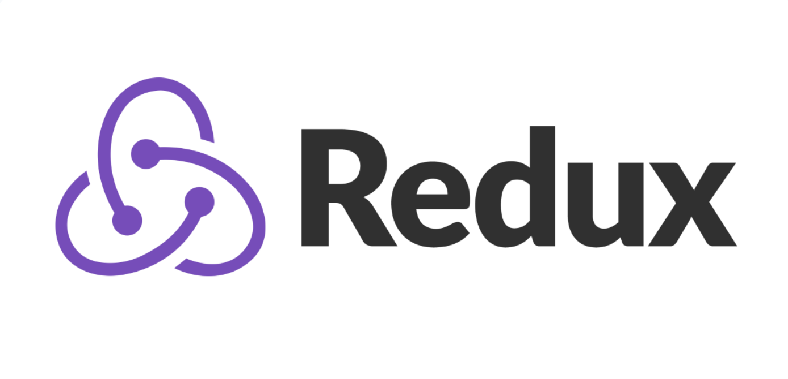
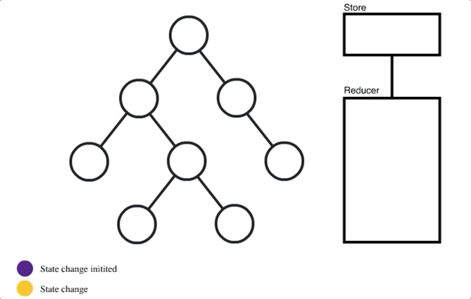
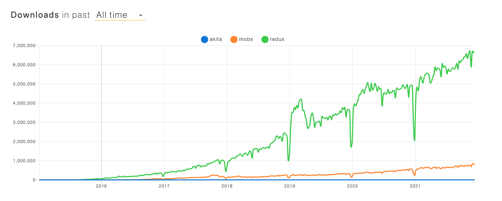
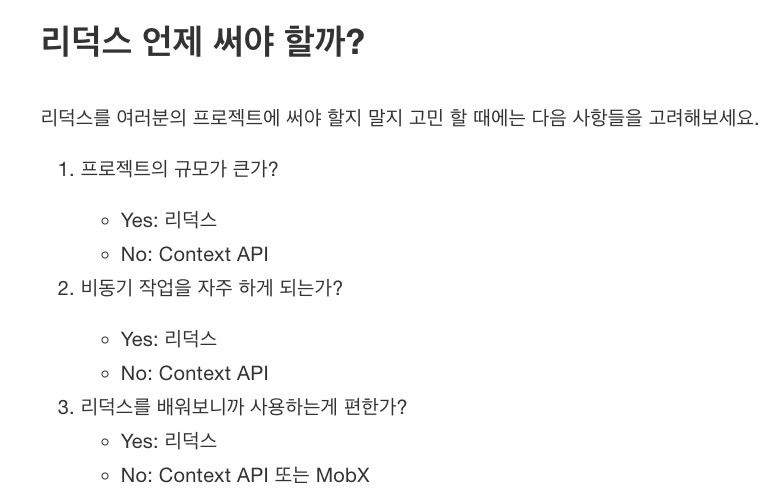

# 1. Redux 기본 개념

## 🔖  Redux 란?

리덕스란 상태관리 라이브러리이다.

## 🔖  상태란?

상태란 단지 데이터이다. 현재 사용자의 이름, 아이디, 댓글 단 횟수 등등. 이런 상태들은 사용자의 동작이나 다른 요소들 때문에 변경이 될 수 있다. 리덕스는 이런 상태들을 관리하는 유용한 도구이다.

## 🔖  리덕스는 리액트에서만 쓸 수 있는 라이브러리?

Redux는 리액트에서 사용하기 위해 만들어진 라이브러리이긴 하지만 무조건 리액트와 함께 사용 할 필요는 없다. 일반 JavaScript 환경에서 사용 할 수도 있고 Angular 같은 다른 프레임 워크에서도 사용되기도 한다.

## 🔖  상태 관리 도구 (State Management Tools)의 필요성?

React는 “단방향 데이터 바인딩”을 가진다. 쉽게 말해서 한방향으로 데이터가 흐른다는 뜻이다. 예를 들어서 App.js라는 부모 컴포넌트에서 스테이트를 TodoList.js라는 자식 컴포넌트에 데이터를 props로 내려준다. 여기서 끝이나면 굳이 Redux가 필요없는데, 이제 TodoList.js의 자식 컴포넌트가 생기고 또 그 밑에 자식 컴포넌트가 생긴다면, props를 계속해서 더 깊이 내려주는 props drilling 현상이 일어나기 시작한다. 프로젝트가 커지면 커질수록 상태를 관리하기 힘들어졌고, 이런 배경이 상태 관리 도구가 필요하게 된 이유이다. 또한 자식 컴포넌트에서 부모 컴포넌트로 상태 업데이트를 쉽게 하기 위해

## 🔖  자식 컴포넌트가 부모에게 상태를 전달 못하기때문에 쓰는건가? No!

리덕스를 사용하는 이유가 처음에는 자식 컴포넌트에서 부모 컴포넌트로 상태를 업데이트 못하는 줄 알았다. 하지만 그게 리덕스를 쓰는 목적이 아니다! 부모 컴포넌트에서 함수를 props로 자식들한테 내려준다면, 자식 컴포넌트에서 값을 바꾸면 부모 컴포넌트가 내려준 함수를 통해서 값을 바꿀 수 있다.

리덕스를 사용하는 이유는 props drilling 현상을 피하기 위해서이다. props drilling 이란 부모가 바로 밑의 자식, 그 밑에 자식, 그 밑에 자식에게 props를 전달하는 카오스 같은 현상이다.

그리고 또한, 자식끼리 상태를 공유하고 싶으면 공통되는 뿌리의 부모 컴포넌트를 찾으러 올라간 후 다시 내려와야 하는 상황이 펼쳐지는데, 마치, 사촌에게 연락하려면 아빠를 통해 할아버지를 통해 삼촌에게 연락한 후 사촌에게 연락하는 복잡한 상황이다.

## 🔖  리덕스의 동작 원리

좀 더 자세한 리덕스의 동작 원리와, 리덕스 관련된 다른 라이브러리를 추후에 정리할 예정이긴하지만, 아주 간단하게 리덕스의 동작 원리를 정리하자면, 밑에서 보는것 같이 리덕스에는 하나의 store이 있어서, 공통적으로 store에서 상태를 업데이트 받는 원리이다.

[ 이미지 출처: [Redux가 필요하다는 것을 언제 알 수 있나요?](https://medium.com/lunit/redux%EA%B0%80-%ED%95%84%EC%9A%94%ED%95%98%EB%8B%A4%EB%8A%94-%EA%B2%83%EC%9D%84-%EC%96%B8%EC%A0%9C-%EC%95%8C-%EC%88%98-%EC%9E%88%EB%82%98%EC%9A%94-426a148da64d) ]

## 🔖  Redux vs. Context Api

Context API는 리액트에서만 쓸 수 있다는 점에서 Redux와 차이를 보인다. 그것 외에는 기능 적을 봤을 때, 리덕스와 똑같이, 상태 관리를 하는 도구라고 생각하면 된다. 애초에 Redux가 Context API를 기반으로 만들어졌기 때문이다. 리덕스는 Redux-logger, thunk 같은 기능들을 추가적으로 사용할 수 있는 게 Context API와 비교했을 때의 장점이다.

## 🔖  왜 리덕스를 선택했나?

패키지 다운로드 수치 비교를 제공하는 [npm trends](https://www.npmtrends.com/)라는 웹사이트르 보았을때, redux가 월등하게 다른 상태 관리 라이브러리보다 다운로드 수가 많다. 그말은 즉, 제일 범용적으로 개발자들 사이에 쓰이고 있다는 뜻이다. context API가 최근에 업데이트 되어서 많이 편해져서 굳이 Redux를 쓰지 않아도 된다고 하지만, 아직 배우는 단계에서 리덕스가 복잡하지만 배우는 것 도 좋다는 생각이다.

---

[ 참고: [벨로퍼트와 함께하는 모던 리액트](https://react.vlpt.us/redux/), [개발후라이](https://egg-programmer.tistory.com/281) ]
