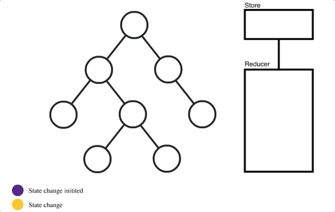

# 2. Redux 동작 원리

## 🔖  리덕스의 동작 원리

- 리덕스에는 하나의 store이 있어서, 공통적으로 store에서 상태를 업데이트 받는 원리이다.
- 액션
  - 상태에 어떠한 변화가 필요하면 액션이란 것이 발생함
  - 이는 하나의 객체로 표현됨
- 액션 생성 함수
  - 객체를 만들어 주는 함수
- 리듀서
  - 변화를 일으키는 함수
  - 현재 상태와 전달받은 액션 객체를 파라미터로 받아 온다. 두 값을 참고하여 새로운 상태를 만들어서 반환해 준다.
- 미들웨어
  - 액션과 리듀서 사이의 중간자
  - 리듀서가 액션을 처리하기 전에 미들웨어가 할 수 잇는 작업들
    - 전달받은액션을 단순히 콘솔에 기록
    - 전달받은 액션 정보를 기반으로 액션을 아예 취소
    - 다른 종류의 액션을 추가로 디스패치 할 수도 있다.
- 스토어
  - 프로젝트에 리덕스를 적용하기 위해 스토어를 만든다.
  - 한개의 프로젝트는 단 하나의 스토어만 가질 수 있다.
  - 스토어 안에는 현재 애플리케이션 상태와 리듀서가 들어있다.
- 디스패치
  - 스토어의 내장 함수 중 하나
  - 댁션을 발생시키는 것 이라고 이해하면 됨
  - dispatch(action) 처럼 액션 객체를 파라미터로 넣어서 호출한다.

---

[ 참고: [Redux가 필요하다는 것을 언제 알 수 있나요?](https://medium.com/lunit/redux%EA%B0%80-%ED%95%84%EC%9A%94%ED%95%98%EB%8B%A4%EB%8A%94-%EA%B2%83%EC%9D%84-%EC%96%B8%EC%A0%9C-%EC%95%8C-%EC%88%98-%EC%9E%88%EB%82%98%EC%9A%94-426a148da64d) ]
