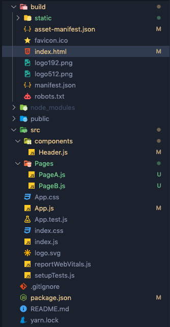

# 1. react-helmet

### 🚀 페이지 별 `<title> <meta>` 넣어주기

SEO최적화를 위해선 meta 태그들을 적어주는게 중요하다. 하지만 React는 하나의 html만 존재하는데 어떻게 각 페이지에대한 설명을 각각 적어줄수 있을까? 그에 대한 방안으로 react-helmet이라는 라이브러리를 사용할수있다.

```jsx
yarn add react-helmet
yarn add react-router-dom
```

```jsx
//App.js

import { BrowserRouter, Route, Routes } from "react-router-dom";
import "./App.css";
import Header from "./components/Header";
import PageA from "./Pages/PageA";
import PageB from "./Pages/PageB";

function App() {
  return (
    <BrowserRouter>
      <Header />
      <Routes>
        <Route path="/" element={<PageA />} />
        <Route path="/pageB" element={<PageB />} />
      </Routes>
    </BrowserRouter>
  );
}

export default App;
```

```jsx
//PageA.js

import React from "react";
import Helmet from "react-helmet";

const PageA = () => {
  return (
    <>
      <Helmet>
        <title>Page A</title>
        <meta name="description" content="This is page A." />
      </Helmet>
      <div>A 페이지 입니다.</div>
    </>
  );
};

export default PageA;
```

```jsx
//PageB.js

import React from "react";
import Helmet from "react-helmet";

const PageB = () => {
  return (
    <>
      <Helmet>
        <title>Page B</title>
        <meta name="description" content="This is page B." />
      </Helmet>
      <div>B 페이지 입니다.</div>
    </>
  );
};

export default PageB;
```

```jsx
//index.js

import React from "react";
import { hydrate, render } from "react-dom";
import "./index.css";
import App from "./App";
import reportWebVitals from "./reportWebVitals";

const rootElement = document.getElementById("root");

if (rootElement.hasChildNodes()) {
  hydrate(
    <React.StrictMode>
      <App />
    </React.StrictMode>,
    rootElement
  );
} else {
  render(
    <React.StrictMode>
      <App />
    </React.StrictMode>,
    rootElement
  );
}

reportWebVitals();
```

### 🚀 build 후 확인



<im src="./Images/2.png"/>

- build 폴더가 생김 → index.html 을 열어서 개발자 도구를 열어보니 여전히 body부분이 비어있음
- pre-rendering을 해주는 react-snap라이브러리를 미리 특정 페이지들을 html 파일로 만들어두고, 검색 엔진이 크롤링할때 이 파일의 내용물을 가져갈 수 있게 해주면된다.

### 🚀 공용 helmet 컴포넌트 만들기

- 모든 페이지에서 일일이 react-helmet을 임포트하고 태그를 적으려면 일이 많다. 그래서 공용적으로 helmet컴포넌트를 하나 만들고 각 페이지에서 import를 한 후에 props로 각 태그의 내용을 내려주면 된다.

```jsx
//ReactHelmet.js

import React from "react";
import Helmet from "react-helmet";

const ReactHelmet = (props) => {
  return (
    <Helmet>
      <title>{props.title}</title>
      <meta name="description" content={props.description} />
      <meta name="keywords" content={props.keywords} />

      <meta property="og:title" content={props.title} />
      <meta property="og:image" content={props.favicon} />
      <meta property="og:site_name" content="" />
      <meta property="og:description" content={props.description} />

      <meta name="twitter:title" content={props.title} />
      <meta name="twitter:description" content={props.description} />
      <meta name="twitter:image" content={props.favicon} />
      <meta name="twitter:card" content="summary" />
    </Helmet>
  );
};

export default ReactHelmet;
```

```jsx
//PageA.js

import React from "react";
import ReactHelmet from "../shared/ReactHelmet";
const PageA = () => {
  return (
    <>
      <ReactHelmet
        title="Page A"
        description="This is Page A."
        keywords="Page A"
      />
      <div>A 페이지 입니다.</div>
    </>
  );
};

export default PageA;
```

```jsx
//PageB.js

import React from "react";
import ReactHelmet from "../shared/ReactHelmet";

const PageB = () => {
  return (
    <>
      <ReactHelmet
        title="Page B"
        description="This is Page B."
        keywords="Page B"
      />
      <div>B 페이지 입니다.</div>
    </>
  );
};

export default PageB;
```

<im src="./Images/3.png"/>

- 짜잔, 이렇게 모든 meta 태그들이 나온다! 정리는 좀 해야겠지만...
