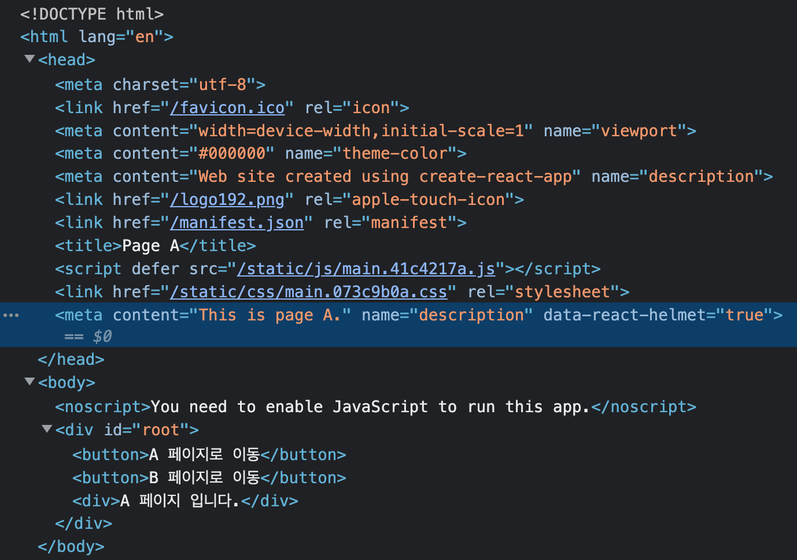
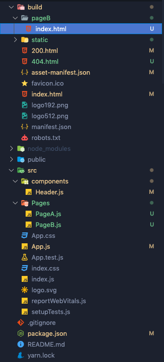
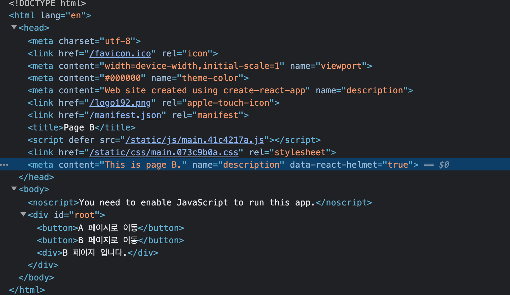
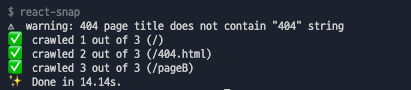

# 2. react-snap

### 🚀 install

```jsx
yarn add react-snap
```

```jsx
//package.json

"scripts": {
	...,
	"postbuild": "react-snap"
}
```

package.json에 이렇게 넣어주면 yarn build 후 react-snap이 작동된다.

### 🚀 build 후 확인




- 우왓! 이제 body안에 컨텐츠도 나오고, head안에도 내가 넣어준 meta태그도 잘 보인다!
- 오잉, 근데 2개의 페이지중에서 메인페이지인 PageA만 보이네!
- 모든 페이지의 내용물을 보여주려면 package.json에 부과적인 처리를 해줘야한다.

### 🚀 원하는 페이지 전부 추가

```jsx
//package.json

"scripts": {
	...,
	"postbuild": "react-snap"
},
"reactSnap": {
	"include": [
		"/", "/pageB"
	]
}
```

- 이런식으로 모든 페이지의 path를 추가해준 후에 다시 build 해보자

### 🚀 마지막 build 후 확인







- pageB라는 폴더 밑에 새로운 index.html이 또 생겨서, 총 2개의 html파일이 생겼다.
- pageB의 index.html을 열어보니 head, body 태그 내용물이 잘 찍히는 것도 확인!
- 그리고 터미널을 보니깐 모든 페이지를 성공적으로 crawled했다고 보여준다!
