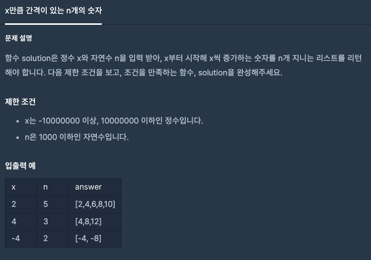
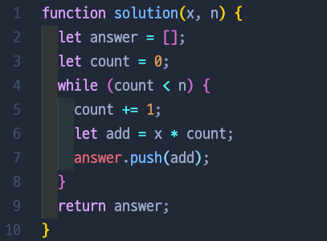

# x만큼 간격이 있는 n개의 숫자

## 📍 문제 & 입출력

## 📍 내가 푼 방법

## 📍 정리

아주 간단한 문제를 풀어서 이렇게 말해도 되는지 모르겠지만, 알고리즘은 풀면 풀수록 실력이 느는 거 같아서 기분이 좋다. 이 문제는 for 문이랑 while 문 둘 중에 뭐를 쓰지? 고민하다가 아무래도 while 문을 더 연습해 보고 싶다는 생각에 while 문을 썼고 한방에 성공!

---

[ 문제 출처: [Programmers](https://programmers.co.kr/) ]
