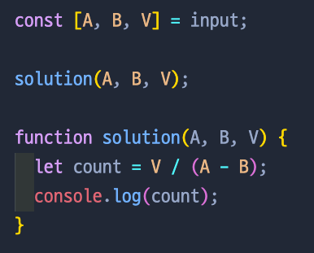
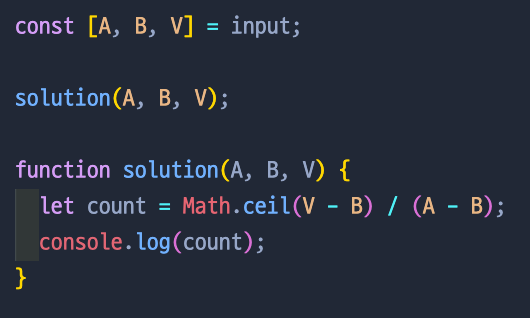

# 달팽이는 올라가고 싶다

📌 `문제`

땅 위에 달팽이가 있다. 이 달팽이는 높이가 V미터인 나무 막대를 올라갈 것이다.

달팽이는 낮에 A미터 올라갈 수 있다. 하지만, 밤에 잠을 자는 동안 B미터 미끄러진다. 또, 정상에 올라간 후에는 미끄러지지 않는다.

달팽이가 나무 막대를 모두 올라가려면, 며칠이 걸리는지 구하는 프로그램을 작성하시오.

📌 `입력`

첫째 줄에 세 정수 A, B, V가 공백으로 구분되어서 주어진다. (1 ≤ B < A ≤ V ≤ 1,000,000,000)

📌 `출력`

첫째 줄에 달팽이가 나무 막대를 모두 올라가는데 며칠이 걸리는지 출력한다.

📌 `예제 입력`
2 1 5
5 1 6

📌 `예제 출력`
4
2

💡 `처음 접근 방법`

우선 input의 첫번째, 두번째, 세번째 값들을 A, B, V로 선언했다. 그 후 단순하게 V 미터인 나무를 올라가고 미끄러진 거리만큼 나누면 된다고 생각했는데, 이렇게 식을 짜면 오답이 나왔다.

💡 `최종 풀이`

무엇이 문제인가 생각했는데, 달팽이가 마지막 날 도착했을때에는 밤에 미끄러지지 않으니깐 그걸 감안하면 V-B로 수식을 짜야했다. 그리고 몫이 딱 떨어지지 않는 날은 하루가 더 필요하니까 Math.ceil일 사용해 수를 하나 올려주었다.

