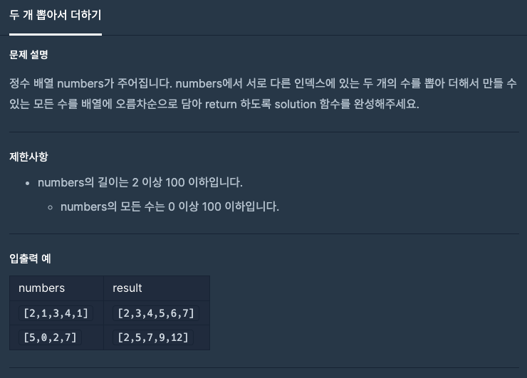
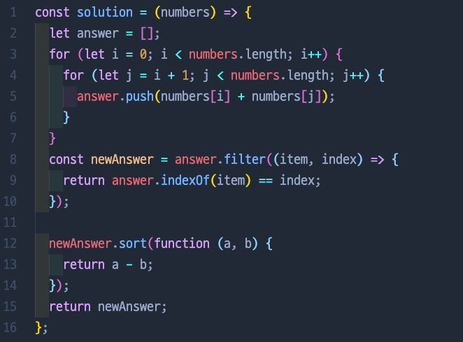
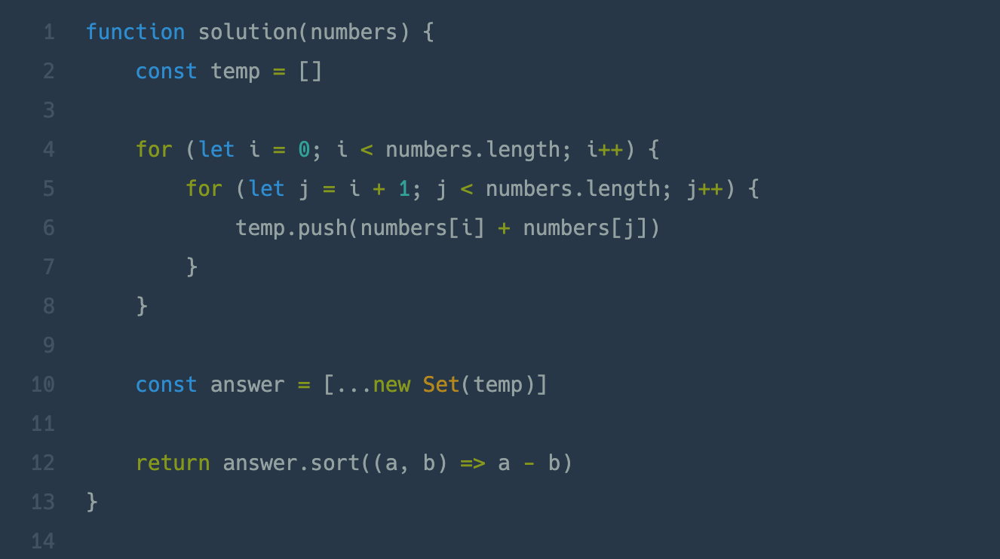

# 두 개 뽑아서 더하기

## 📍 문제 & 입출력

## 📍 내가 푼 방법

## 📍 다른 사람들이 푼 방법

## 📍 정리

- let answer =[ ] 이라고 변수를 선언함으로써 마지막 answer 변수 이름을 바꿔야 했다. temp같은 변수로 처음 선언하는것 좋을듯
- filter, indexOf 방식 말고 set이라는 새로운 문법을 써서 시도해보자
- sort(function(a,b) ⇒ {return...}) 이렇게 복잡하게 말고 (a,b) ⇒ a-b 간단하게 쓸 수 있음!

---

[ 문제 출처: [Programmers](https://programmers.co.kr/) ]
