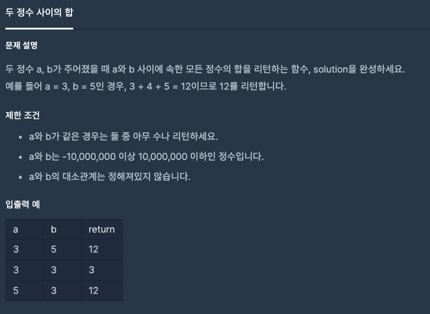
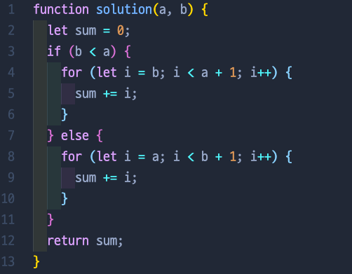
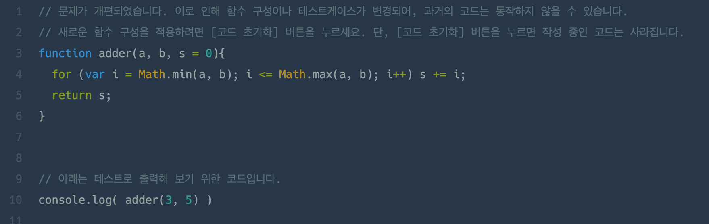

# 두 정수 사이의 합

## 📍 문제 & 입출력

## 📍 내가 푼 방법

## 📍 다른 사람들이 푼 방법

## 📍 정리

간단한 문제여서 간단하게 풀었지만, 조건문안에서 for문을 두번 돌리는게 싫었다 😭  다른 분의 풀이를 보고 배운 것은 Math를 사용해서 a, b 중 큰 숫자와 작은 수를 지정해서 조건문 없이 풀이를 한 방법이다. SMART!

---

[ 문제 출처: [Programmers](https://programmers.co.kr/) ]
