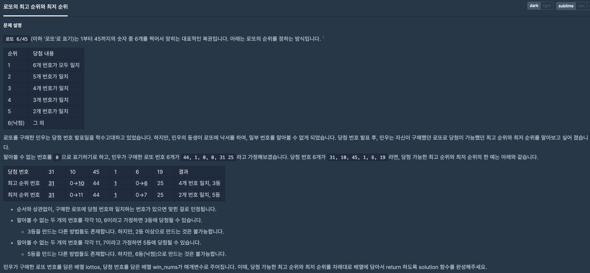
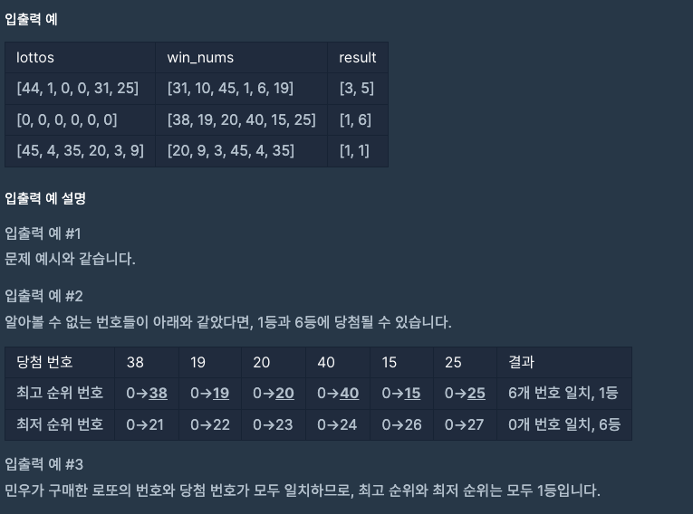
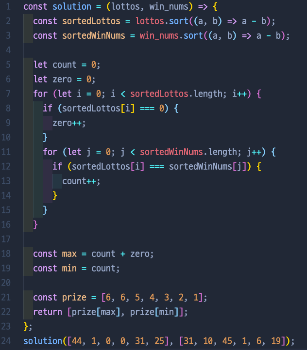
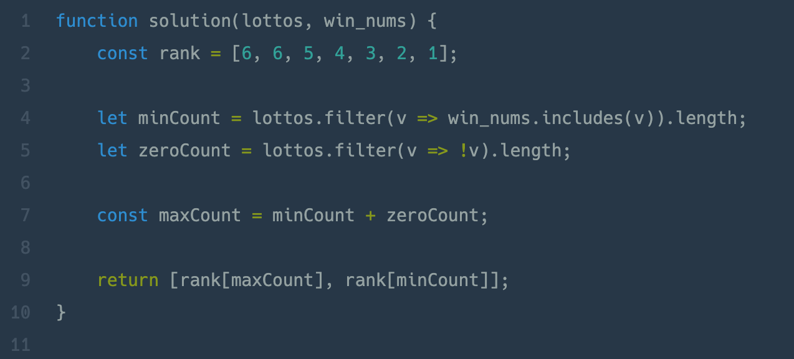

# 로또의 최고 순위와 최저 순위

## 📍 문제 & 입출력

## 📍 내가 푼 방법

## 📍 다른 사람들이 푼 방법

## 📍 정리

- 문제의 길이가 길어서 처음에는 겁을 먹었던 문제였다. 문제를 읽어나가다 보니 괜찮은 것 같은 느낌이었다. 결론은, 문제의 길이에 비해서 쉽게 풀었다는 느낌이었다. 마지막에 이제 로또 몇 등인지를 출력해야 하는 상황에서 if 문을 써야 하나 싶었지만 배열로 만들어서 코드를 줄일 수 있었다.
- 다른 분들이 해놓은 풀이를 보고 코드를 좀 더 효율적으로 쓸 수 있는 메소드를 공부해야겠다.

---

[ 문제 출처: [Programmers](https://programmers.co.kr/) ]
