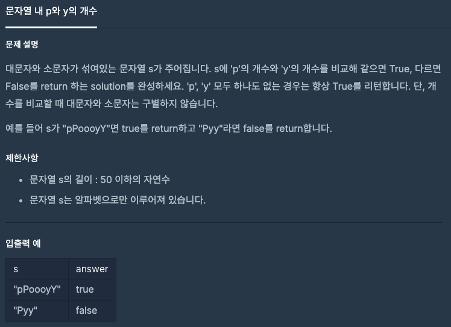
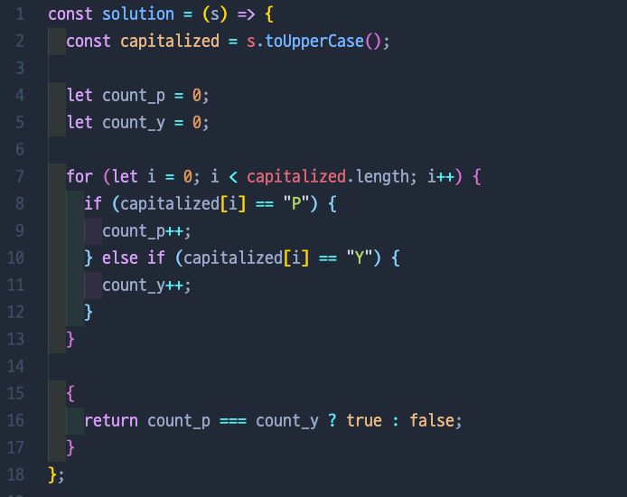
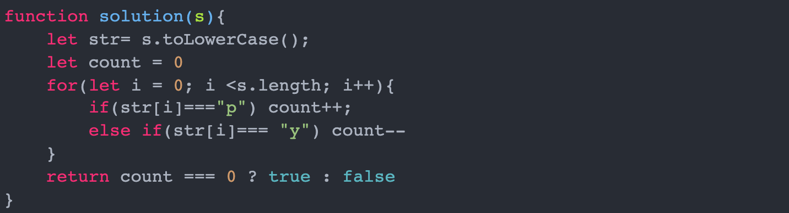

# 문자열 내 p와 y의 개수

## 📍 문제 & 입출력

## 📍 내가 푼 방법

## 📍 다른 사람들이 푼 방법

## 📍 정리

- 우선 가닥은 잘 잡았다! 처음에 오류가 났던 이유는 소문자, 대문자 변환을 해주지 않아서 오류가 났다! 하지만 toUpperCase()를 사용해서 대문자로 변환후 비교해주니 아무 문제없이 잘 해결!
- 나는 count_p와 count_y라는 변수 두개를 사용해서 수를 비교해줬는데,
  다른 분은 아예 count++, count- - 식으로 하나로 관리했다. 보기 깔끔해~

---

[ 문제 출처: [Programmers](https://programmers.co.kr/) ]
