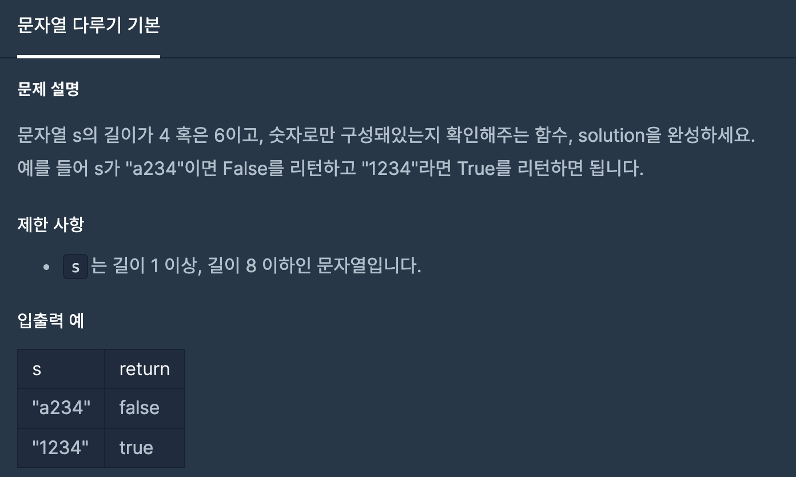
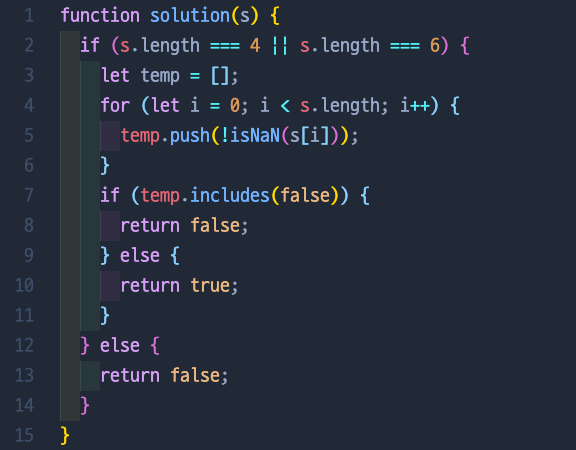
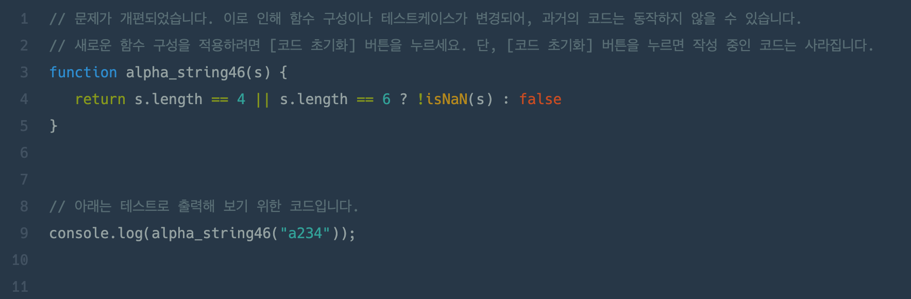

# 문자열 다루기 기본

## 📍 문제 & 입출력

## 📍 내가 푼 방법

## 📍 다른 사람들이 푼 방법

## 📍 정리

- 내 코드 너무 ... 지저분 😭 코드가 짧다고 항상 좋은 코드는 아닌것같다. 하지만 다른분이 푸신 풀이를 보니깐, 와웅 정말 깔끔! 구현하려는 코드가 무엇인지도 잘 나타나면서도 간결해서 가독성이 좋은코드다!

---

[ 문제 출처: [Programmers](https://programmers.co.kr/) ]
