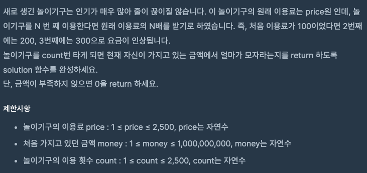
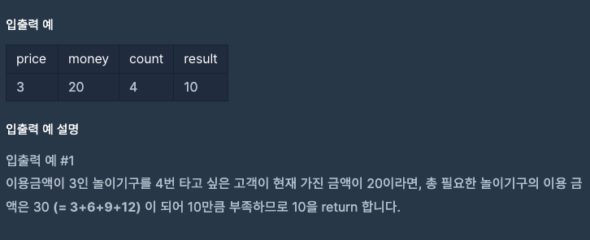
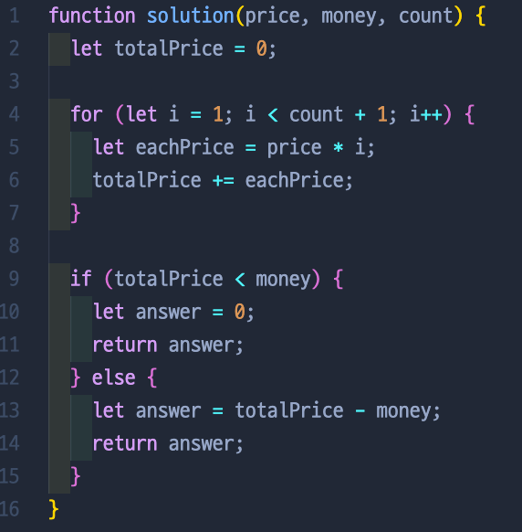
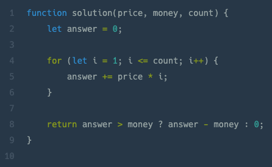

# 부족한 금액 계산하기

## 📍 문제

## 📍 입출력

## 💡  내가 푼 방법

> 쉬운 문제여서 쉽게 풀었지만, for문을 좀 더 깔끔하게 써야 한다는 생각이 든다.
>
> 

## 💡  다른 사람들이 푼 방법

> 다른 사람의 코드를 참고했는데, 왜 나는 반복문에서 count를 i < count+1을 했을까 하는 생각도 들었다 ㅎㅎ 끝에도 삼항연산자를 쓰면 되는데 너무 길게 ... ㅎㅎ 썼네 ㅎㅎ
>
> 

[ 문제 출처: [Programmers](https://programmers.co.kr/) ]
