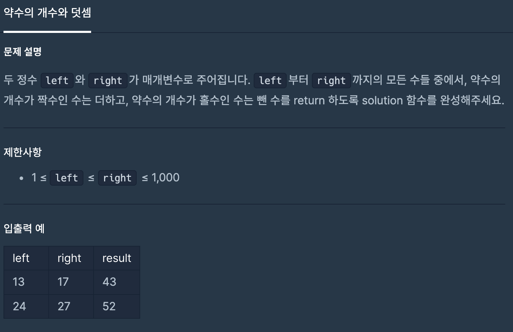
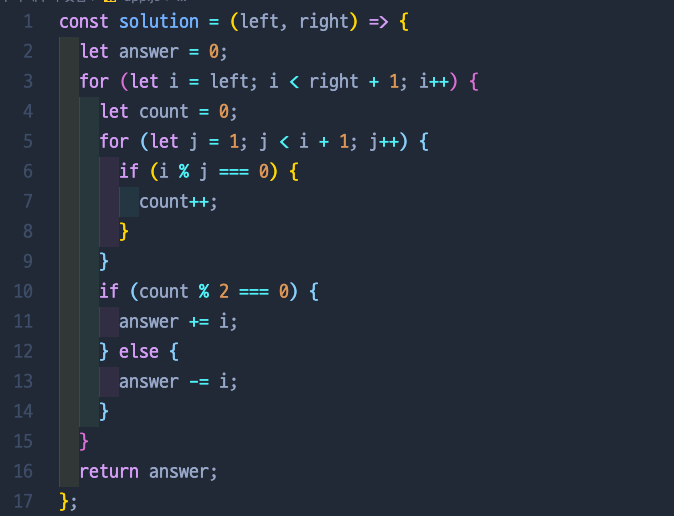
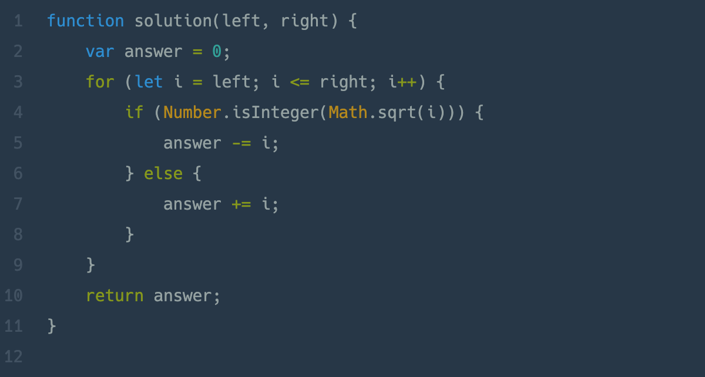

# 약수의 개수와 덧셈

## 📍 문제 & 입출력

## 📍 내가 푼 방법

## 📍 다른 사람들이 푼 방법

## 📍 정리

for 문을 두 번 돌려서 과연 효율성 테스트에서 통과가 될까 걱정이었지만, 무사히 통과! 다른 분이 풀이하신 거를 한 번 더 공부해 봐야겠다.

---

[ 문제 출처: [Programmers](https://programmers.co.kr/) ]
