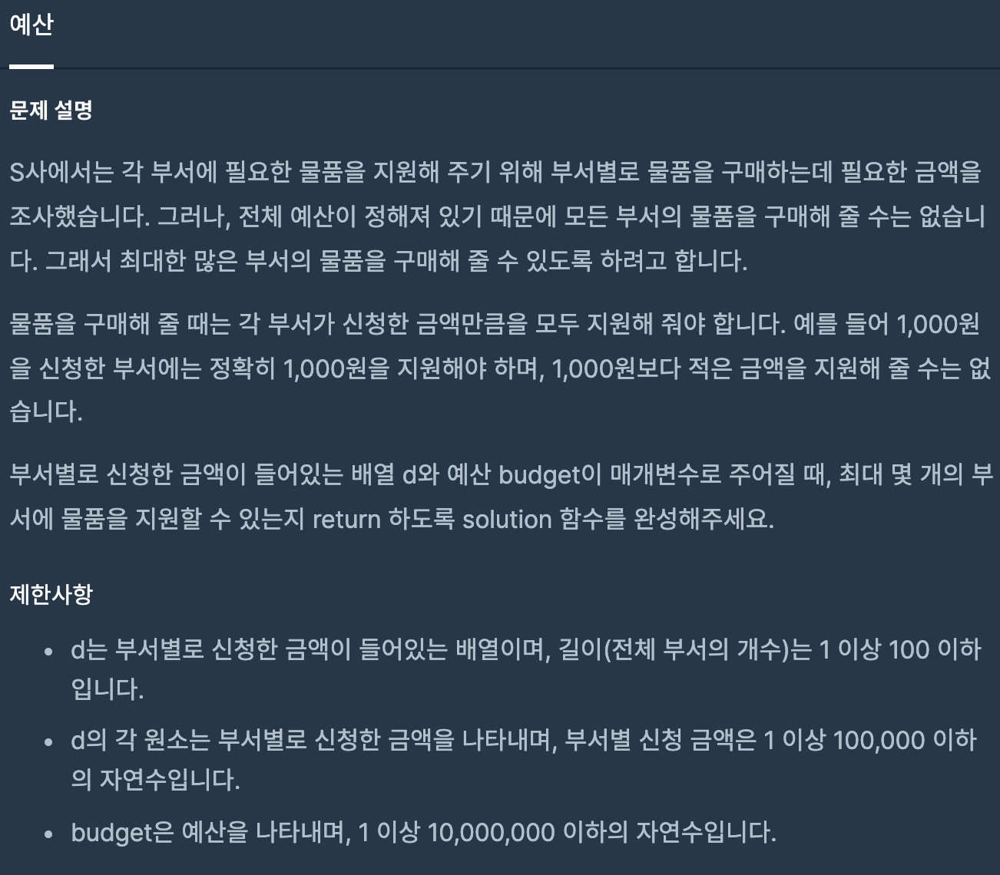
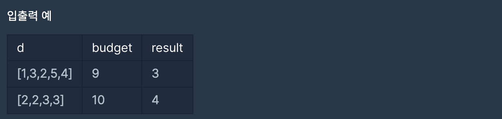
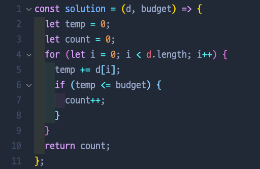

# 예산

## 📍 문제 & 입출력

## 📍 내가 푼 방법

## 📍 정리

처음에는 위에 sort를 해줘서 작은 수부터 최대한 많은 예산을 잡을 수 있게 했지만, 결국에는 그 식을 쓰지 않고 테스트에 통과됐다. 근데 아마도 sort를 해주고 테스트를 돌려야지 통과돼야 할 거 같은데...? 왜 통과됐지? 다시 한번 풀어봐야겠다.

---

[ 문제 출처: [Programmers](https://programmers.co.kr/) ]
