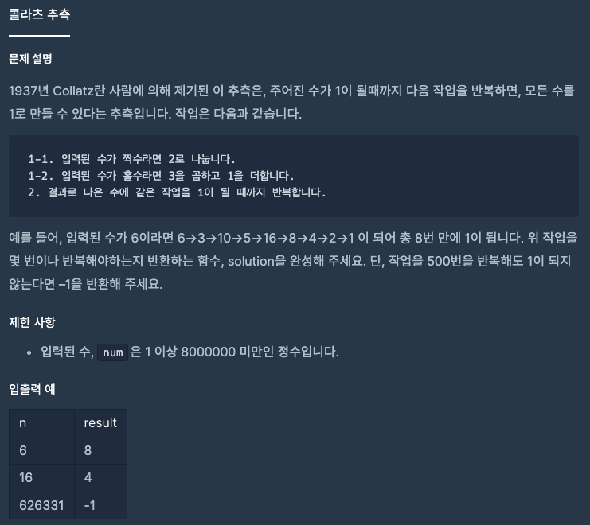
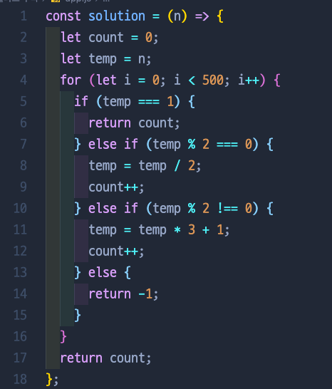
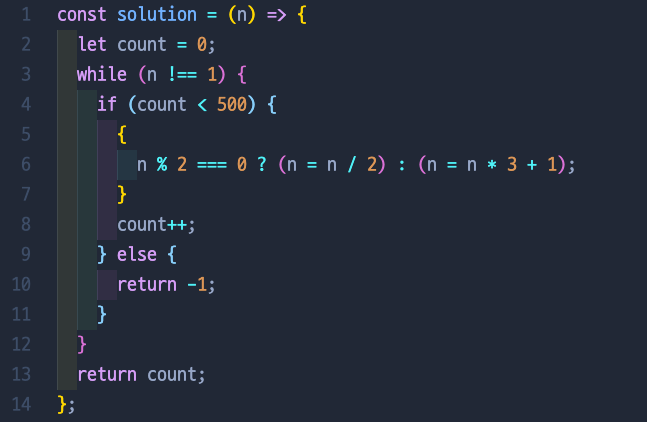
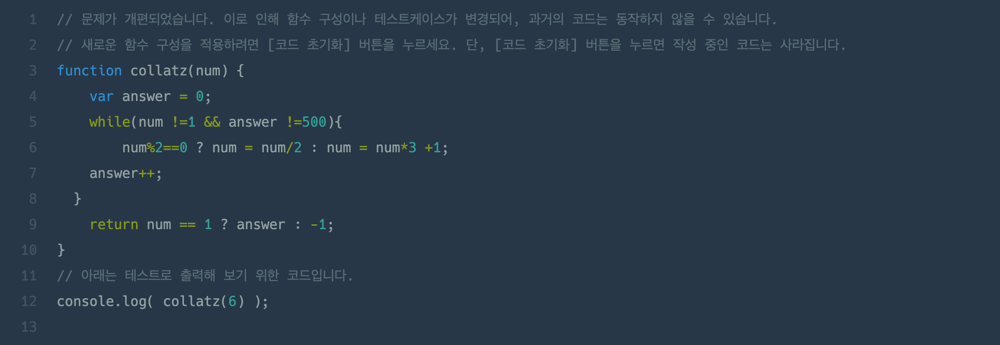

# 콜라츠 추측

## 📍 문제 & 입출력

## 📍 처음 시도

## 📍 최종 풀이 방법

## 📍 다른 사람들이 푼 방법

## 📍 정리

- 처음에는 방향을 잃고 for문 안에다가 버라이어티한 if문을 넣어서 풀이를 시도했다. 나중에는 for문 보다는 while문으로 좀 더 깔끔하게 + 삼항연산자로 풀이했다.
- 다른 분이 푸신 풀이를 봤는데, while문에 조건을 동시에 2개를 주었다! 엄청 깔끔!!

---

[ 문제 출처: [Programmers](https://programmers.co.kr/) ]
